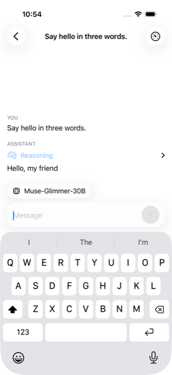
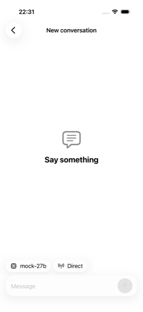
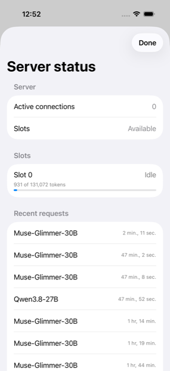
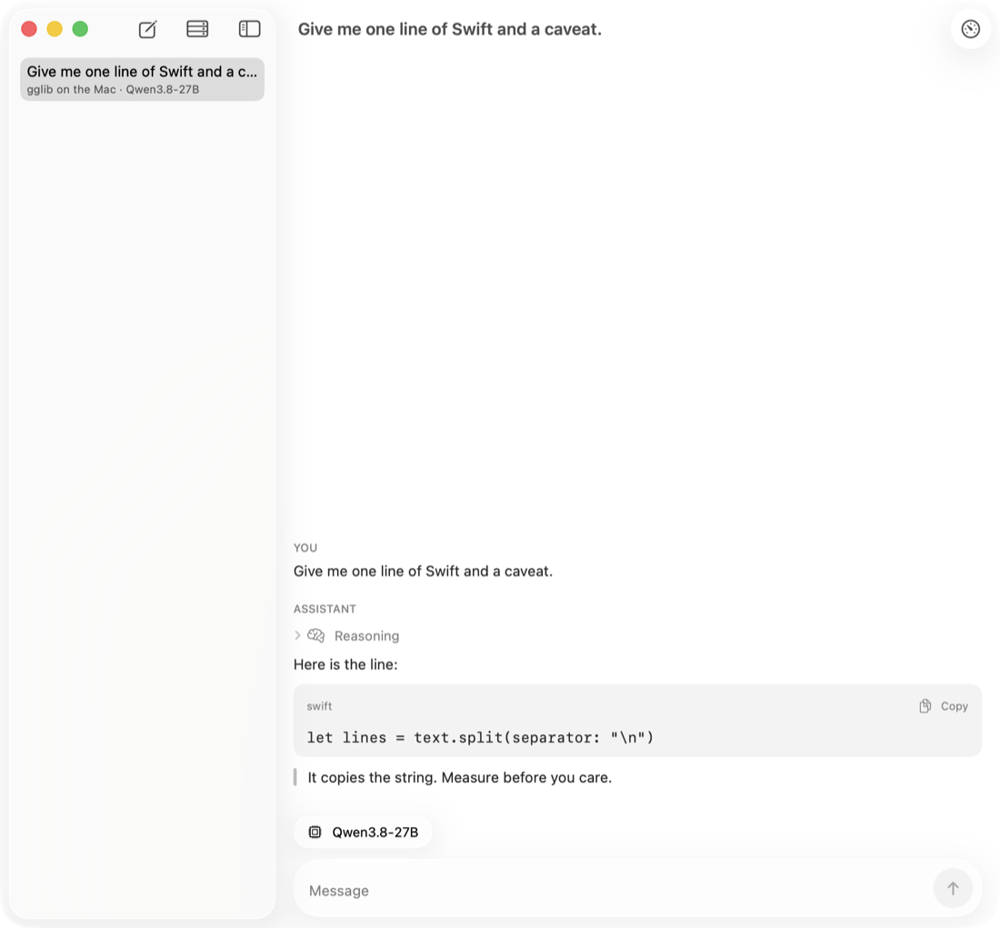

# ggchat


A native Apple chat client for OpenAI-compatible model servers, built so
that a server on your desk at home will be reachable from your phone
anywhere, with no port forwarding, no VPN, no account, and no cloud in the
path. That reach will come from [modelpipe](https://github.com/mmogr/modelpipe).
The app is generic: any OpenAI-compatible provider works.
[gglib](https://github.com/mmogr/gglib) is the provider it is built around.

## What it looks like

| Streaming from gglib | A pipe, connected | gglib's server status |
|---|---|---|
|  |  |  |



These are photographs of the app, not mock-ups. The three iPhone ones are
attachments the UI tests take as they walk through it, and `make
screenshots` regenerates them from a test run, so a picture cannot quietly
go stale. The first is a real reply from gglib.

## Status

v0.1.0 is released. What exists today is the core package (the provider
protocol, the OpenAI-compatible implementation, the SSE parser, ticket
shape validation, the pipe seam with its mock) and the app shell: a
sidebar of conversations persisted with SwiftData, a providers sheet that
adds a server by address or a pipe by ticket and token, and settings. The
transcript streams replies as markdown with copyable code blocks and
collapsed reasoning, with a stop button and, when a reply stops early, a
Continue button. A server added by address lists its models and streams;
against gglib, a server status pane shows slots, context in use and recent
requests, and it is hidden for servers that do not answer that endpoint.
The app has been run: the screens below are photographs of it, not
mock-ups. A pipe provider is added by pasting a ticket and token, or on iOS by
scanning a QR code; connecting goes through `PipeConnector`, whose only
implementation today is a mock that walks idle → relayed → direct. The
status pill follows it and becomes a reconnect button when the pipe
closes. Settings shows the readings the ADRs name, each with its
denominator. In DEBUG builds a mock provider streams canned replies
without a server. The pipe path is a mock until `modelpipe-ffi` exists,
and that mock is DEBUG-only: a released build refuses to dial and says so,
rather than answering a real ticket with a reply no machine wrote. Nothing
here links Rust or iroh.

## What is true today

Each claim names the test that keeps it true.

- A stream captured from a running gglib parses to the same events whether
  it arrives whole or one byte at a time.
  <!-- test: SSEParserTests.testFeedingOneByteAtATimeGivesTheSameItems -->
- gglib's first chunks carry no `choices` key; reasoning arrives as
  `reasoning_content`; the usage chunk has empty `choices`. All three decode.
  <!-- test: WireTests.testFirstChunkHasNoChoicesKeyAndStillDecodes -->
  <!-- test: WireTests.testReasoningArrivesAsReasoningContent -->
  <!-- test: WireTests.testUsageChunkHasEmptyChoicesAndCachedTokens -->
- A server's error sentence is shown verbatim, and every documented
  modelpipe and gglib code says which machine to look at.
  <!-- test: ErrorTests.testServerMessageIsRenderedVerbatim -->
  <!-- test: ErrorTests.testEveryDocumentedCodeNamesWhereToLook -->
- A ticket's shape is validated without decoding it: `pipe` prefix in any
  ASCII case, base32 body, no padding, at most 1643 characters, and
  non-ASCII is rejected before any case folding. A real ticket from
  `modelpipe serve` is 81 characters and is accepted in either case.
  <!-- test: TicketTests.testTheShapeARealTicketHas -->
  <!-- test: TicketTests.testLongestPossibleTicketIsAcceptedAndOneMoreIsNot -->
  <!-- test: TicketTests.testNonASCIIIsRejectedBeforeCaseFolding -->
- The mock pipe walks idle → relayed → direct, can be forced closed, and a
  late subscriber gets the current status first.
  <!-- test: MockPipeTests.testStatusWalksIdleRelayedDirectThenClosedOnDemand -->
- The mock is DEBUG-only. A build without one refuses a perfectly good
  ticket with a sentence about the build, instead of mocking a pipe that
  is not there.
  <!-- test: UnavailablePipeTests.testABuildWithNoPipeRefusesAGoodTicketInsteadOfMockingOne -->
  <!-- test: UnavailablePipeTests.testTheRefusalIsASentenceThatBlamesTheBuildAndNotTheUser -->
- A bearer token is sent on every request and never reaches a log line.
  <!-- test: OpenAICompatibleProviderTests.testNoCredentialEverReachesALogLine -->
- gglib's proxy status endpoint decodes when it answers and is `nil` on 404.
  <!-- test: OpenAICompatibleProviderTests.testProxyStatusIsNilOn404AndDecodesOn200 -->
- An unterminated code fence, as seen mid-stream, renders as a code block.
  <!-- test: MarkdownTests.testUnterminatedFenceIsStillACodeBlock -->
- A `ProviderConfig` holds no credential; a pipe config carries only a
  digest of its ticket.
  <!-- test: ProviderConfigTests.testPipeProviderRoundTripsAndHoldsOnlyADigest -->
- A pasted address becomes a base URL: a bare host gets `/v1`, a trailing
  slash is dropped, anything that is not http or https is refused.
  <!-- test: BaseURLNormalizationTests.testBareHostGetsV1AndTrailingSlashIsDropped -->
- Conversations, their messages in order, and providers survive a round
  trip through SwiftData; deleting a conversation cascades to its messages.
  <!-- test: SwiftDataStoreTests.testConversationsRoundTripWithMessagesInOrder -->
- Sending streams the reply, with reasoning kept separately, into the
  conversation; a dropped stream keeps the partial reply on screen and
  Continue extends that same message rather than starting a new one.
  <!-- test: AppModelStreamingTests.testSendStreamsAReplyIntoTheConversation -->
  <!-- test: AppModelStreamingTests.testADroppedStreamKeepsThePartialAndContinueCarriesOn -->
- Exactly three custom glass surfaces exist, all in one file inside one
  `GlassEffectContainer`; `scripts/check_glass_sites.sh` counts them, and
  `scripts/check_no_hand_drawn_glass.sh` refuses any material or
  translucent fill elsewhere, so Reduce Transparency and Increase Contrast
  are the system's to honour — and the test measures the glass going flat
  rather than trusting the setting, because the launch arguments that look
  like it are accepted and change nothing. Symbol effects and the streaming
  animation switch off under Reduce Motion, and the pills stack at
  accessibility type sizes.
  <!-- test: ReduceTransparencyUITests.testGlassGoesFlatWhenTransparencyIsReduced -->
- With `GGCHAT_LIVE_BASE_URL` set, the app model adds that server by URL,
  lists its models, streams a complete reply and probes the status endpoint.
  <!-- test: LiveAppModelTests.testAddByURLListModelsStreamAndProbeStatus -->
- Connecting a pipe provider walks the status to direct, fires the one
  haptic once, records the ticket's digest, and streams through the
  session's loopback URL with the token as the key; a forced close is
  counted and reconnecting dials again without counting the ticket twice.
  <!-- test: AppModelPipeTests.testConnectWalksToDirectAndStreamsThroughTheSessionURL -->
  <!-- test: AppModelPipeTests.testForceClosedIsCountedAndReconnectDialsAgain -->
- The Diagnostics readings survive a relaunch, and only a transport error
  within five seconds of a resume counts against ADR 0001.
  <!-- test: DiagnosticsTests.testReadingsPersistWithTheirDenominators -->
- A first-time user can add a provider, start a conversation, send a
  message and watch the reply stream in, driven through the real app on a
  simulator. The same walk runs against a server on this machine when one
  is listening, and skips when none is.
  <!-- test: FirstRunUITests.testFirstRunWithTheMockProvider -->
  <!-- test: FirstRunUITests.testFirstRunAgainstAServerOnThisMachine -->
- A credential that will not save takes the provider with it, rather than
  leaving one that fails later, and the reason names the credential.
  <!-- test: AddProviderFailureTests.testACredentialThatWillNotSaveLeavesNoHalfAddedProvider -->
  <!-- test: AddProviderFailureTests.testTheKeychainErrorSaysWhichCredentialAndWhy -->
- The screens the first-run walk never reaches are visited and photographed
  too: the provider form and what it says about a bad address or ticket, a
  pipe connecting and its status pill, the providers list, and the
  diagnostics readings.
  <!-- test: ScreenGalleryUITests.testAPipeConnectsAndTheStatusPillWalks -->
  <!-- test: ScreenGalleryUITests.testTheProviderFormExplainsABadTicket -->
- gglib's server status pane fills in from a real server, and is not
  offered at all by a provider that does not report one.
  <!-- test: RemainingScreensUITests.testTheServerStatusPaneAgainstARealServer -->
  <!-- test: RemainingScreensUITests.testTheStatusPaneIsHiddenForAServerThatDoesNotReport -->
- A closed pipe turns its status pill into a reconnect, and pressing it
  brings the pipe back.
  <!-- test: RemainingScreensUITests.testAClosedPipeOffersAReconnect -->
- Text grows at the largest accessibility size, and the test measures it,
  so a launch argument that silently changes nothing cannot pass for a
  Dynamic Type check.
  <!-- test: RemainingScreensUITests.testTheAppAtAnAccessibilityTypeSize -->
- Reopening the app returns you to the conversation you left.
  <!-- test: SwiftDataStoreTests.testAppModelKeepsSelectionAndPersistsThroughTheStore -->
- A block quote's `>` marker and a list item's indentation stay out of the
  rendered text.
  <!-- test: MarkdownTests.testListsHeadingsQuotesAndRules -->

## Building and testing

Requires Xcode 26 and Swift 6.2 or later.

```sh
swift build && swift test
```

Against a running gglib (or any OpenAI-compatible server) the live test
lists models and streams one short reply:

```sh
GGCHAT_LIVE_BASE_URL=http://127.0.0.1:8080/v1 make test-live
```

Set `GGCHAT_LIVE_API_KEY` as well to point it at a server that wants a
bearer token, which is how it runs against a modelpipe pipe.

`make ci` runs what CI runs: `make fmt-check`, `make lint`,
`make boundaries`, `make enforce`, `make build`, `make test`,
`make unused`, `make docs`. `make bootstrap` installs the Homebrew tools
those need (xcodegen, swiftlint, periphery, actionlint).

The app target is generated from `App/project.yml` by xcodegen
(`make project`) and committed. Open `App/ggchat.xcodeproj` in Xcode, or
build from the command line:

```sh
xcodebuild build -project App/ggchat.xcodeproj -scheme ggchat -destination 'platform=macOS'
xcodebuild build -project App/ggchat.xcodeproj -scheme ggchat -destination 'generic/platform=iOS Simulator'
```

`make uitest` drives the app on a booted iPhone simulator: the first-run
flow, and a walk through the screens that flow never reaches. It always
runs against the DEBUG mock provider, and also against a server on
`127.0.0.1:8080` when one is listening. The builds are signed ad-hoc,
because an unsigned iOS app has no Keychain access and this app keeps
every credential there.

`make uitest-dark` and `make uitest-contrast` run the same walk with the
device set to dark mode and to Increase Contrast. Both are settings on the
simulator rather than launch arguments, so each target sets one, checks
`simctl` reads it back, and restores it afterwards even if the walk fails.
Reduce Transparency has no `simctl` option and no working launch argument,
so its test sets it through Settings and measures the result instead.

## Layout

```
Sources/GGChatCore/   no SwiftUI; the provider protocol, wire types, SSE, ticket, pipe seam, mocks
Sources/GGChatUI/     SwiftUI; the app model, views, and SwiftData persistence
App/                  the xcodegen spec, the generated project, and a @main struct with assets
Tests/GGChatCoreTests XCTest; fixtures are real captures from gglib
Tests/GGChatUITests   the app model, streaming, the pipe, and the SwiftData store
App/ggchatUITests     XCUITest that drives the first-run flow on a simulator
docs/adr/             decisions, each with a kill criterion that names a reading
scripts/              the checks CI runs; `make ci` runs the same ones
```

## The seam

The pipe path stops at two protocols, `PipeConnector` and `PipeSession`.
[docs/ffi-seam.md](docs/ffi-seam.md) states what `modelpipe-ffi` must
provide in their terms, and which tests already assert each behaviour
against the mock.

## Decisions

- [ADR 0001](docs/adr/0001-loopback-port-at-the-ffi-seam.md): a loopback
  port, not a request API, at the ffi seam.
- [ADR 0002](docs/adr/0002-an-in-flight-request-is-kept-not-re-sent.md): an
  in-flight request on reconnect is kept, not re-sent.
- [ADR 0003](docs/adr/0003-keychain-access-group.md): one Keychain access
  group for both builds, once there is a signing team.

## Releases

Versions come from [release-please](https://github.com/googleapis/release-please):
conventional commit titles on `main` accumulate into a release PR, and
merging it tags the version and rewrites `Config/Version.xcconfig`.
Documentation is built with DocC and deployed to GitHub Pages on release.

## House rules

- Commit messages and PR titles say what the system now does, as a
  sentence: `feat(chat): the composer keeps its draft across a provider switch`.
- Every sentence in this README is true, and where a claim can be tested a
  test keeps it. `scripts/check_readme_claims.sh` checks that every marker
  above names a test that exists.
- No credential in any log line, ever.
- Time is an argument: nothing in `GGChatCore` reads the clock except
  `Clock.swift`.
