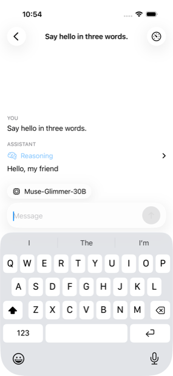
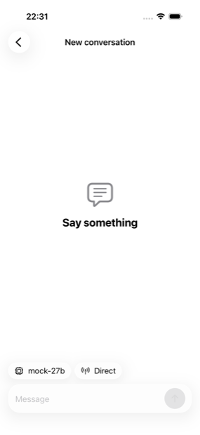
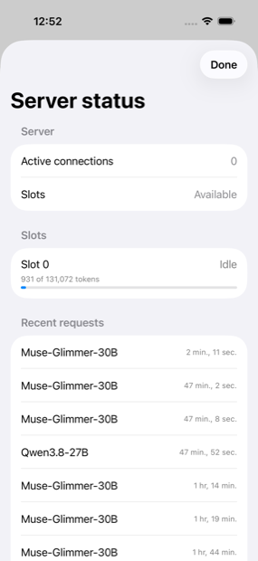
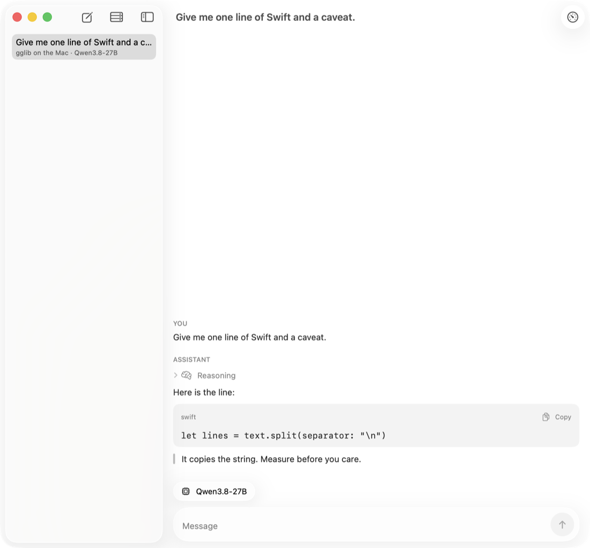

# ggchat


A native Apple chat client for OpenAI-compatible model servers, built so
that a server on your desk at home is reachable from your phone
anywhere, with no port forwarding, no VPN, no account, and no cloud in the
path. That reach comes from [modelpipe](https://github.com/mmogr/modelpipe).
The app is generic: any OpenAI-compatible provider works.
[gglib](https://github.com/mmogr/gglib) is the provider it is built around.

## What it looks like

| Streaming from gglib | A pipe, connected | gglib's server status |
|---|---|---|
|  |  |  |



These are photographs of the app, not mock-ups. The three iPhone ones are
attachments the UI tests take as they walk through it, and `make
screenshots` regenerates them from a test run, so a picture cannot quietly
go stale. The first is a real reply from gglib.

## Status

Each release is on the [releases page](https://github.com/mmogr/ggchat/releases),
with what it changed. What exists today is the core package (the provider
protocol, the OpenAI-compatible implementation, the SSE parser, the pipe
seam with its mock, its pairing and its reader) and the
app shell: a sidebar of conversations persisted with SwiftData, a
providers sheet
that adds a server by address or a pipe by its pairing string,
and settings. The transcript streams replies as markdown with copyable code
blocks, tables drawn as tables, and collapsed reasoning, with a stop button and, when a reply stops
early, a Continue button, and each conversation can carry a system prompt of
its own, set from the toolbar and sent ahead of every request without ever
becoming a row in the transcript; a request refused before anything arrived
says why under the question, with a Retry button. A server added by address lists its models and
streams; against gglib, a server status pane shows slots, context in use
and recent requests, and it is hidden for servers that do not answer that
endpoint. The app has been run: the screens above are photographs of it,
not mock-ups. A pipe provider is added by pasting the `ticket-code` string
the other machine showed for it (`gglib remote enable --invite` for the
first device, `gglib remote invite` for each one after that), or on iOS by
scanning its QR code: the six-digit code is spent once, through the pipe
itself, for a key minted for this device alone, so no key is ever read off
one screen and typed into another — and the pipe it was spent over is the
one that provider keeps, so a first pairing costs one hole punch and not
two. A bare ticket, with no code, is for a device that already holds its
key. Connecting goes through `PipeConnector`: a release build dials and
pairs with `ModelpipeConnector`, and a DEBUG build uses a mock that walks
idle → relayed → direct. The status pill
follows the session, reads "Reconnect" when the pipe closes, and stays
pressable in every state but a dial in flight, because a connected status
can be stale. Going
to the background hangs up every pipe and puts down the reply in flight,
except a reply to gglib, which the hub goes on writing and the app reads on
from where it stopped, and coming back dials again. A provider's row opens its settings, so a
machine that has stopped admitting this device, or whose endpoint identity
was deleted, is re-paired in place and keeps its conversations. Settings
shows how many distinct tickets this device has connected to. In DEBUG
builds a mock provider streams canned replies without a server.

**A shipped build now dials for real.** `GGChatPipe` is a target of its own
that links `modelpipe-ffi`, and it is the only place the boundary check
permits `import Modelpipe`; `ModelpipeConnector` behind it has modelpipe read
a ticket, dials, and hands back a session whose loopback URL is the far
machine. The
mock stays on the DEBUG side of `PipeConnectorFactory` rather than being
replaced, because it is what the Settings screen's "Force closed" control and
twenty-odd app-model tests are written against. It is absent from a release
build, not merely unchosen: `MockPipeConnector` and `MockPipeSession` are
declared inside an `#if DEBUG`, and `make build-release` fails if either
symbol is in the release objects.

## What is true today

Each claim names the test that keeps it true.

- A stream captured from a running gglib parses to the same events whether
  it arrives whole or one byte at a time.
  <!-- test: SSEParserTests.testFeedingOneByteAtATimeGivesTheSameItems -->
- When the request asks for progress, gglib's first chunks carry it and no
  `choices` key; reasoning arrives as `reasoning_content`; the usage chunk
  has empty `choices`. All three decode.
  <!-- test: WireTests.testFirstChunkHasNoChoicesKeyAndStillDecodes -->
  <!-- test: WireTests.testReasoningArrivesAsReasoningContent -->
  <!-- test: WireTests.testUsageChunkHasEmptyChoicesAndCachedTokens -->
- A server's error sentence is shown verbatim, and every code modelpipe and
  gglib write says which machine to look at, that the request itself was
  refused, or that the answer is to wait. The side named is the side that
  wrote the refusal, which is not always the side you are sitting at. The
  codes are an enum, so the mapping is exhaustive by the compiler rather
  than by a list someone remembers to extend, and the half of it modelpipe
  publishes is checked against modelpipe's own list. A key the serving machine no
  longer admits says so, and the line after it says where a new key comes
  from, which depends on the kind of provider: a pipe pairs again with
  `gglib remote invite`, and a server's key is checked in its settings.
  <!-- test: ErrorTests.testAKeyTheServingMachineNoLongerAdmitsSaysSo -->
  <!-- test: AppModelRefusalTests.testTheAdviceUnderARefusalFollowsTheKindOfProvider -->
  <!-- test: ErrorTests.testServerMessageIsRenderedVerbatim -->
  <!-- test: ErrorTests.testEveryDocumentedCodeNamesWhereToLook -->
  <!-- test: ErrorTests.testThePublishedHalfOfTheVocabularyIsModelpipesOwnList -->
  <!-- test: ErrorTests.testTheSideNamedIsTheSideThatWroteTheRefusal -->
  <!-- test: ErrorTests.testAMachineThatIsMerelyBusySaysToWaitRatherThanNamingASide -->
- A message carries its images by reference: the SHA-256 of the bytes,
  their type and size, which is how gglib names a stored image. A request
  reads the bytes from this device's store, once per image, in one place
  for a send, Retry and a run's `PUT` sent again, and an image that cannot
  be read sends nothing. On the wire a turn with images is its text, then
  one `image_url` part per image in order; a turn with none is the bare
  string it always was, byte for byte. gglib's model list says which model
  reads images with `vision`. A direct chat to a model that cannot is
  refused by name either way it goes: the chat route answers 400 at once,
  and a run takes the `PUT` and then fails with the code. Each of gglib's
  six image codes says what to change, and an image's cost is gglib's own
  estimate.
  <!-- test: ImageRefTests.testTheIdIsTheSHA256OfTheBytesInLowercaseHex -->
  <!-- test: ImageRefTests.testItReadsAndWritesGGLibsAttachmentInfo -->
  <!-- test: ImageRefTests.testTheTokenEstimateIsGGLibsRule -->
  <!-- test: ImageRefTests.testTheModelListSaysWhichModelReadsImages -->
  <!-- test: ImageContentWireTests.testARequestWithNoImagesIsTheSameBytesAsBefore -->
  <!-- test: ImageContentWireTests.testATurnWithImagesIsItsTextThenEachImageInOrder -->
  <!-- test: ImageContentWireTests.testATurnOfImagesAloneHasNoTextPart -->
  <!-- test: ImageContentWireTests.testATurnNamingAnImageWithNoBytesIsNotEncoded -->
  <!-- test: ImageRefusalTests.testEachImageCodeSaysWhatToChange -->
  <!-- test: ImageRefusalTests.testTheChatRouteRefusesAnImageAtOnceByName -->
  <!-- test: ImageRefusalTests.testABodyOverTheLimitIsRefusedAsTooLarge -->
  <!-- test: ImageRefusalTests.testARunIsTakenThenFailsWithTheCode -->
  <!-- test: AppModelImageRequestTests.testARequestHoldsEveryImageItsTurnsNameReadOncePerImage -->
  <!-- test: AppModelImageRequestTests.testATurnsImageIsSentAndOneThatCannotBeReadSendsNothing -->
  <!-- test: AppModelImageRequestTests.testARunPutAgainCarriesItsImageOrIsGivenUpWithoutIt -->
  <!-- test: AppModelImageRequestTests.testARunToAModelThatCannotSeeEndsWithTheCodeAndWhatToDo -->
- An image joins a draft through the photo picker, a paste or a drop, and
  every one goes through one downscale: turned upright by its orientation,
  2560 pixels on its long edge at most and never made larger, none of the
  original's metadata (its location included), a PNG while one fits in
  8 MiB and a JPEG otherwise, refused with a sentence when even that does not
  fit, and named by the SHA-256 of the bytes sent. The draft shows each with
  gglib's token estimate, and a turn of images alone is sent and drawn. A
  model gglib lists without `vision` cannot see: an image added for it, or a
  draft with images to it, is refused here with gglib's own sentence, the
  draft kept with its text and images, and a draft of text alone still goes
  to it; any other server is sent them. A turn the server refuses keeps its
  images for Retry. The bytes are kept once each beside the store, opened
  across the change both ways, deleted with the last turn that names them or
  taken back when a draft is refused partway, and gone after a reset.
  <!-- test: ImageDownscaleTests.testAnImageIsTurnedUprightByItsOrientation -->
  <!-- test: ImageDownscaleTests.testTheLongEdgeIsAtMost2560AndASmallImageIsNotMadeLarger -->
  <!-- test: ImageDownscaleTests.testAPNGStaysAPNGWhileItFitsAndOtherwiseIsAJPEG -->
  <!-- test: ImageDownscaleTests.testNothingOfTheOriginalsMetadataIsSent -->
  <!-- test: ImageDownscaleTests.testTheIdIsTheSHA256OfTheBytesSent -->
  <!-- test: AppModelImageSendTests.testOnlyAModelGGLibListsWithoutVisionCannotSee -->
  <!-- test: AppModelImageSendTests.testADraftWithAnImageToAModelThatCannotSeeIsRefusedHere -->
  <!-- test: AppModelImageSendTests.testATurnOfImagesAloneIsSentAndItsBytesAreKept -->
  <!-- test: AppModelImageSendTests.testADraftWhoseImageCannotBeKeptIsRefused -->
  <!-- test: AppModelImageSendTests.testATurnTheServerRefusesKeepsItsImagesForRetry -->
  <!-- test: AppModelImageSendTests.testEachImageInTheStripSaysWhatGGLibEstimatesItCosts -->
  <!-- test: AppModelImageSendTests.testAnImageAddedForAModelThatCannotSeeIsRefusedAtOnce -->
  <!-- test: AppModelImageSendTests.testARefusedDraftLeavesNoImageBehindThatNoTurnNames -->
  <!-- test: DraftTests.testARefusedDraftKeepsItsTextAndImagesAndATakenOneIsEmpty -->
  <!-- test: DraftTests.testTheSameImageAddedTwiceIsOne -->
  <!-- test: ConversationTests.testAFirstTurnOfImagesAloneIsCalledWhatItHolds -->
  <!-- test: ImageStoreTests.testATurnsImagesAndTheirBytesOutliveAReopening -->
  <!-- test: ImageStoreTests.testAnImageGoesWithTheLastTurnThatNamesIt -->
  <!-- test: ImageStoreTests.testAStoreOpensAcrossTheImagesChangeInBothDirections -->
  <!-- test: ImageStoreTests.testTheResetLeavesNoImageFileBehind -->
  <!-- test: FirstRunUITests.testAPastedImageIsSentAloneAndDrawnInTheTranscript -->
- A pairing string is read by modelpipe as it is typed and as it is scanned,
  against `docs/pairing-v0.md`'s normative vectors: the ticket comes back in
  its canonical lower-case form, so a QR scan and a paste of the same machine
  store one digest; whether a code is there is all that crosses, never the
  digits; and the sentence under the field when it will not read is
  modelpipe's own, with neither the paste nor the binding's type names in it.
  It is a decode and not a glance at the shape, so a ticket with a bad
  checksum is refused where it was typed — and, as the spec says, ASCII
  whitespace around a paste is trimmed and Unicode whitespace is not. The one
  thing the form decides for itself, whether anything has been typed yet, is
  decided over that same ASCII set, so the app holds no second opinion about
  which spaces count in a pairing string or a ticket, and a field holding one
  non-breaking space is read and refused rather than passed off as empty. The
  app keeps no parser of its own, in a debug build either.
  <!-- test: PairingReaderTests.testTheAcceptedVectorsReadAsTheSpecSays -->
  <!-- test: PairingReaderTests.testAQRScanReadsTheSameTicketAsThePaste -->
  <!-- test: PairingReaderTests.testABareTicketCarriesNoCode -->
  <!-- test: PairingReaderTests.testARefusalIsModelpipesOwnSentenceAndNotThePaste -->
  <!-- test: PairingReaderTests.testATicketWithABadChecksumIsRefusedAsItIsTyped -->
  <!-- test: PairingReaderTests.testUnicodeWhitespaceIsNotTrimmed -->
  <!-- test: PairingFieldTests.testOnlyModelpipesOwnWhitespaceCountsAsNothingTyped -->
  <!-- test: PairingReaderWiringTests.testTheFactoryHandsOutModelpipesReaderInDebugToo -->
  <!-- test: PairingReaderWiringTests.testTheAppModelTakesThatReaderByDefault -->
- Pairing is modelpipe's own, and the pipe a device paired over is the one
  it keeps: the whole `ticket-code` string goes to `PipeConnector.pair`,
  which dials the ticket, waits for the far machine, spends the code there,
  and hands back this device's key over a pipe still up. The key becomes
  the provider's token and that pipe becomes its first session, so nothing
  is dialled twice. A refused code leaves no provider behind and says where
  the next attempt starts, and the form stops asking for a token once it
  has a code to fetch one with.
  <!-- test: ModelpipeConnectorPairingTests.testThePipeTheCodeWasRedeemedOverIsTheSession -->
  <!-- test: ModelpipePairRefusalTests.testARefusedCodeKeepsItsOwnCaseAndSaysWhereToGetANewOne -->
  <!-- test: AppModelPairingTests.testARedeemedCodeBecomesTheProvidersTokenAndThePipeConnects -->
  <!-- test: AppModelPairingTests.testARefusedCodeAddsNoProviderAndSaysWhy -->
  <!-- test: ScreenGalleryUITests.testAPairingCodeIsRedeemedInsteadOfAskingForAToken -->
- A desktop still on gglib 0.18 pairs another way: its edge spends the code
  and its proxy has no such route, so it answers the pairing request `404`.
  Pairing with one says that the code has been spent, and that gglib there
  needs updating to a version newer than 0.18 before it is asked for another.
  Any other status, and any answer carrying no status at all, says only that
  the code may have been spent — an unexplained answer is not blamed on a
  version.
  <!-- test: ModelpipePairRefusalTests.testADesktopTooOldToPairSaysToUpdateItAndThatTheCodeIsSpent -->
  <!-- test: ModelpipePairRefusalTests.testAStatusOtherThanNotFoundIsNotBlamedOnTheDesktopsVersion -->
  <!-- test: ModelpipePairRefusalTests.testAnyOtherAnswerThatIsNotAPairingAnswerSaysTheCodeMayBeSpent -->
- A pairing is the longest wait in the app, so the app being left under one
  is ordinary rather than exotic: the pipe it was about to install is hung up
  instead of kept, the key is stored all the same, and the provider is left
  with a pill to press and a status the next resume will dial. While a pairing
  is out, Reconnect is not offered for that provider, because pressing it
  would dial the machine being replaced with the token being replaced.
  <!-- test: AppModelPairingTests.testAPairingThatLandsWhileTheAppIsAwayKeepsItsKeyAndItsPill -->
  <!-- test: AppModelPairingTests.testReconnectIsNotOfferedWhileAPairingIsOut -->
- The name typed for this device travels with the pairing as its label, and
  the other machine lists this device under it. A name that is blank once
  trimmed is not sent at all: no label, rather than an empty one. The app
  model never sends the provider's name, which names the other machine, in
  its place.
  <!-- test: ModelpipeConnectorPairingTests.testTheLabelRidesAsGivenAndABlankOneIsNotSent -->
  <!-- test: AppModelPairingTests.testTheNameTypedForThisDeviceIsWhatTheRedeemCarries -->
  <!-- test: AppModelPairingTests.testWithNoDeviceNameTheProvidersNameIsNotSentInItsPlace -->
- The modelpipe binding is linked and answers across the boundary: a string
  that is not a ticket comes back as an `MpError` with a sentence in it. The
  xcframework is a binary fetched at resolve time and checked against a uniffi
  checksum only on first use, so a mismatched pair traps on a device rather
  than failing a build — something has to call across the boundary on every
  run, and this is it. Its four statuses cross into the app's own unchanged.
  <!-- test: BindingTests.testTheBindingIsLinkedAndAnswersAcrossTheBoundary -->
  <!-- test: BindingTests.testEveryPipeStatusCrossesUnchanged -->
  <!-- test: BindingTests.testARelayedPipeCountsAsConnected -->
- A real connector has modelpipe read the ticket before it dials, with the
  same call the form reads what is typed with, so a ticket that is not one and
  an empty token each cost nothing — which matters for the bare ticket a
  device that already holds its key is added by, where every request through
  the pipe would be refused at the far edge after a dial spent finding out. A
  string that carries a code is refused there too: a code is redeemed once,
  through the pairing, and dialling it would spend it on nothing.
  <!-- test: ModelpipeConnectorTests.testATicketOfTheWrongShapeIsRefusedWithoutDialling -->
  <!-- test: ModelpipeConnectorTests.testAPairingStringWithACodeIsRefusedWithoutDialling -->
  <!-- test: ModelpipeConnectorTests.testAnEmptyTokenIsRefusedEvenThoughTheBindingWouldNotWantIt -->
- This device keeps one endpoint key per machine it pairs with, so the
  fingerprint the other machine recorded as this device paired still names
  this device after a relaunch, rather than a peer that stopped existing when
  the app was quit. This app gives the keys a directory of their own under
  Application Support, readable by this user alone and marked out of the
  backup, and modelpipe names and writes them inside it; two machines are two
  keys, because a relay allows one live connection per endpoint and a phone
  talking to two desktops needs two. The key admits nothing — what admits this
  device is the token beside it in the Keychain — and
  [ADR 0004](docs/adr/0004-the-connect-identity-is-a-file.md) is why it is a
  file all the same. Naming each key file used to be this app's job and is
  now the binding's, so the two have to land on the same name or every
  already-paired device would quietly introduce itself as a stranger, with no
  build failure and no log line. A test asserts that name as a literal from
  both sides of the boundary.
  <!-- test: BindingTests.testTheKeyFilesNameIsTheSameRuleOnBothSidesOfTheBoundary -->
  <!-- test: PipeIdentityFilesTests.testTheKeysLiveInADirectoryWhoseNameDoesNotMove -->
  <!-- test: BindingTests.testADeviceThatKeepsItsKeyIsTheSameDeviceNextTime -->
  <!-- test: ModelpipeConnectorIdentityTests.testTheShippedConnectorKeepsAKeyWhereItSaysItDoes -->
  <!-- test: ModelpipeConnectorIdentityTests.testEveryDialCarriesTheDirectoryThisDeviceKeepsItsKeysIn -->
  <!-- test: ModelpipeConnectorPairingTests.testAPairingIsMadeAsTheDeviceThatWillDialLater -->
  <!-- test: PipeIdentityFilesTests.testNamingTheDirectoryPutsNothingInIt -->
  <!-- test: PipeIdentityFilesTests.testTheDirectoryIsMadePrivateAndKeptOutOfTheBackup -->
- A key that machine's modelpipe will not accept — one half written by a
  process that was killed, say — is thrown away and the dial tried once more,
  because the advice it used to be refused with, remove the file or choose
  another path, is not something a phone offers anybody. That happens inside
  the binding now, which is the layer that decides the file's name. Once
  only: a refusal that reaches this app is one the discard could not fix, so
  it is not dialled again here and the person gets the sentence instead.
  <!-- test: BindingTests.testAKeyThisDeviceCannotUseIsThrownAwayAndTheDialTriedAgain -->
  <!-- test: ModelpipeConnectorIdentityTests.testAnIdentityRefusalIsNotDialledAgainOnThisSide -->
  <!-- test: ModelpipeConnectorTests.testAnIdentityFileThatCannotBeUsedIsASentenceAndNotWorthDiallingAgain -->
- A failure from the transport, from a pairing, or from an identity file
  this device cannot use, reaches the person as a sentence, never as the
  binding's own debug rendering, and says whether trying again is worth it.
  <!-- test: ModelpipePairRefusalTests.testEveryPairingErrorArrivesAsASentenceAndNotADebugRendering -->
  <!-- test: ModelpipePairRefusalTests.testTheFailuresNoRetryCanFixAgreeWithTheBinding -->
  <!-- test: ModelpipeConnectorTests.testATransportErrorArrivesAsASentenceAndNotADebugRendering -->
  <!-- test: ModelpipeConnectorTests.testABadTicketIsNotWorthDiallingAgain -->
  <!-- test: ModelpipeConnectorTests.testTheBindingDecidesWhatIsWorthRepeating -->
  <!-- test: ModelpipeConnectorTests.testAnIdentityFileThatCannotBeUsedIsASentenceAndNotWorthDiallingAgain -->
- A pipe that dies on its own still says `closed`. The binding ends its status
  sequence on any close, and nothing above the seam writes a status when a
  stream merely finishes, so the session writes it before finishing.
  <!-- test: ModelpipeSessionTests.testAPipeThatDiesOnItsOwnStillSaysClosed -->
- `relayed` is held back for a moment in case a direct path is behind it, and
  shown when nothing better follows. A hole punch commonly reaches a relay
  first, and a pill that flashes "Relayed" reads as a warning about a
  connection that is still being made.
  <!-- test: ModelpipeSessionTests.testRelayedDoesNotFlashWhenDirectIsAMomentBehindIt -->
  <!-- test: ModelpipeSessionTests.testRelayedIsShownWhenNothingBetterFollows -->
- A pipe's base URL has to be loopback with a port, not merely something
  `URL(string:)` accepted — it parses strings with spaces and no scheme at all.
  <!-- test: ModelpipeSessionTests.testAnAddressOffLoopbackIsRefused -->
- A dial the person asked for says why it failed; one they did not — the
  resume dials every pipe it is holding none of — says nothing and leaves the
  pill as the way back. A machine that is asleep would otherwise raise an
  alert on every return to the foreground, carrying only the last provider's
  sentence.
  <!-- test: AppModelQuietDialTests.testADialSomebodyAskedForSaysWhatWentWrong -->
  <!-- test: AppModelQuietDialTests.testAResumeThatFindsTheMachineAsleepSaysNothing -->
- A dial whose task is called off complains to nobody: nobody is waiting
  for its answer.
  <!-- test: AppModelQuietDialTests.testADialThatIsCalledOffSaysNothing -->
- When the Keychain will not read a pipe's ticket or token for a dial, as
  before the device's first unlock, the dial says the Keychain's own
  reason, on the question waiting for the pipe or in the alert. Only a
  credential that is not there is called missing: a missing one is a reason
  to pair again, and a refused read is not.
  <!-- test: AppModelKeychainReadTests.testAReadTheKeychainRefusesIsSaidAsThatRefusal -->
  <!-- test: AppModelKeychainReadTests.testASendWaitingOnThePipeShowsTheRefusalOnItsQuestion -->
  <!-- test: AppModelKeychainReadTests.testAQuietDialLogsTheRefusalAndRaisesNoAlert -->
  <!-- test: AppModelPipeTests.testConnectWithoutSecretsRefusesWithASentence -->
  <!-- test: KeychainSecretsTests.testAReadThatFailsForAnyOtherReasonThrows -->
- A pipe that dies quietly is forgotten, so the next resume dials it again
  instead of finding a dead session installed and refusing.
  <!-- test: AppModelQuietDialTests.testASessionThatEndedIsForgottenSoAResumeCanDialAgain -->
  <!-- test: AppModelQuietDialTests.testAnOldSessionEndingDoesNotRemoveTheOneThatReplacedIt -->
- Pairing waits for the far machine before spending the code, and the real
  `mpPair` is what waits. A dial returns once the local port is bound, not
  once the peer answers, and a redeem sent into that gap is answered `502` by
  this device's own end of the pipe, which never had a backend to reach.
  That spends the one-time code on nothing and needs a fresh
  `gglib remote invite`.
  <!-- test: BindingTests.testPairingWaitsForTheFarMachineBeforeSpendingTheCode -->
- The mock pipe walks idle → relayed → direct, can be forced closed, and a
  late subscriber gets the current status first.
  <!-- test: MockPipeTests.testStatusWalksIdleRelayedDirectThenClosedOnDemand -->
- A pipe that goes away without being asked says which side to look at. The
  binding reports a shutdown and a failed listener and nothing else, so a peer
  that simply stopped answering closes with no reason recorded — and that
  silence, not an open pipe, is what it is read as.
  <!-- test: PipeCloseReasonTests.testEveryReasonThatWasNotAskedForHasASentenceNamingASide -->
  <!-- test: ModelpipeSessionTests.testAPeerThatSimplyVanishesIsSaidToHaveVanished -->
  <!-- test: AppModelCloseReasonTests.testAPeerThatVanishesLeavesAReasonBesideTheStatusAndOneSentence -->
- A close the app asked for — the background, a reconnect, a provider deleted
  — explains nothing and says nothing, because it is something the person just
  did.
  <!-- test: PipeCloseReasonTests.testAHangUpThisAppAskedForIsNotWorthASentence -->
  <!-- test: AppModelCloseReasonTests.testAHangUpTheAppPerformedExplainsNothingAndSaysNothing -->
- Each pipe keeps when its machine was last heard, through a relaunch, and
  Settings says it; once the machine has failed to answer, and never while a
  pipe reconnects, a line under the pill names it with that time. The line
  under a `tunnel_unavailable` refusal names the other machine as well as this
  device, and a refused pairing says to run `gglib remote forget` there first
  if this device is still listed.
  <!-- test: AppModelLastHeardTests.testAPipeThatConnectsIsHeardThen -->
  <!-- test: AppModelLastHeardTests.testAPipeThatGoesQuietKeepsItsTime -->
  <!-- test: AppModelLastHeardTests.testARefusalWrittenOnThisSideIsNotHearing -->
  <!-- test: AppModelLastHeardTests.testAFinishedReplyIsHeard -->
  <!-- test: AppModelLastHeardTests.testAModelListAndAStatusAnswerAreHeard -->
  <!-- test: AppModelLastHeardTests.testRemovingTheProviderForgetsWhenItWasHeard -->
  <!-- test: AppModelLastHeardTests.testTheLineSaysTheTimeAndTheDateWhenItWasNotToday -->
  <!-- test: LastHeardStoreTests.testTheTimeSurvivesARelaunchOfTheStore -->
  <!-- test: LastHeardStoreTests.testAStoreWrittenBeforeTheColumnOpensWithItEmpty -->
  <!-- test: SilenceCaptionTests.testTheCaptionStaysAwayWhileAPipeReconnects -->
  <!-- test: SilenceCaptionTests.testTheCaptionShowsWhenAConnectedPipeGoesQuietUntilItConnects -->
  <!-- test: SilenceCaptionTests.testTheCaptionShowsWhenThePipeClosesOrTheDialFails -->
  <!-- test: SilenceCaptionTests.testAServerAddedByAddressIsNeitherHeardNorMarked -->
  <!-- test: SilenceCaptionTests.testTheCaptionShowsWhenARequestFindsNoTunnel -->
  <!-- test: QuietMachineTests.testTheTunnelHintNamesTheOtherMachineAsWellAsThisDevice -->
  <!-- test: QuietMachineTests.testARefusedPairingSaysToForgetAStillListedDeviceFirst -->
  <!-- test: QuietMachineTests.testAQuietMockGoesBackToLookingAndDoesNotClose -->
- Settings shows what each live pipe says about itself: its path, the loopback
  port it bound, and what its endpoint spent on relays.
  <!-- test: ModelpipeSessionTests.testTheReadingsCrossTheSeamInTheAppsOwnVocabulary -->
- Settings says the day this build stops opening, read from the provisioning
  profile signed into it: a free team's build stops with its profile, seven
  days after the profile was issued, and a later build can carry the same
  one. A build with no profile, from the simulator, the App Store or
  TestFlight, has no such line.
  <!-- test: ProvisioningProfileTests.testTheDateIsReadFromTheListInsideTheEnvelope -->
  <!-- test: ProvisioningProfileTests.testABlobWithNoListHasNoDate -->
  <!-- test: ProvisioningProfileTests.testAListWithoutAnExpirationDateHasNoDate -->
  <!-- test: ProvisioningProfileTests.testABundleWithNoProfileHasNoDate -->
  <!-- test: ProvisioningProfileTests.testABundlesProfileIsReadUnderItsName -->
  <!-- test: SettingsBuildExpiryTests.testTheLineSaysTheDayThisBuildStopsOpeningWhereThePersonIs -->
  <!-- test: SettingsBuildExpiryTests.testABuildWithNoDateHasNoLine -->
  <!-- test: ScreenGalleryUITests.testTheProvidersListAndTheTicketCountInSettings -->
- The mock is DEBUG-only. A build without one refuses a perfectly good
  ticket with a sentence about the build, instead of mocking a pipe that
  is not there.
  <!-- test: UnavailablePipeTests.testABuildWithNoPipeRefusesAGoodTicketInsteadOfMockingOne -->
  <!-- test: UnavailablePipeTests.testTheRefusalIsASentenceThatBlamesTheBuildAndNotTheUser -->
- A bearer token is sent on every request and never reaches a log line.
  <!-- test: OpenAICompatibleProviderTests.testNoCredentialEverReachesALogLine -->
- No line the app writes as it dials a pipe, loses one or pairs carries a
  ticket, a token or a pairing code.
  <!-- test: AppModelPipeLogTests.testNoPipeOrPairingLineCarriesATicketATokenOrACode -->
- `PairedPipe`, `Paired` and `OpenAICompatibleProvider` print the key they
  hold as `<redacted>`, and a `ReadPairing` prints its ticket as the
  ticket's digest, whether interpolated, reflected or dumped, so a log line
  that interpolates one of them whole carries neither.
  <!-- test: RedactedDescriptionTests.testAPairedPipePrintsItsDeviceAndNeverItsKey -->
  <!-- test: RedactedDescriptionTests.testAReadPairingPrintsItsDigestAndNeverItsTicket -->
  <!-- test: PairedDescriptionTests.testPairedPrintsItsDeviceAndNeverItsKey -->
  <!-- test: RedactedDescriptionTests.testAProviderPrintsItsAddressAndNeverItsKey -->
- gglib's proxy status endpoint decodes when it answers and is `nil` on 404.
  A loop-guard trip is read under the key gglib sends, and under the one an
  older hub sent.
  <!-- test: OpenAICompatibleProviderTests.testProxyStatusIsNilOn404AndDecodesOn200 -->
  <!-- test: ProxyStatusHelperTests.testTheLoopGuardIsReadUnderTheKeyGGLibSendsAndTheOldOne -->
- A pipe with no session is not asked for its status pane, so the probe as a
  conversation opens raises no alert and keeps no answer. The pane is asked
  for again each time a pipe a conversation has been opened on comes up, and a
  probe called off before it was answered keeps nothing.
  <!-- test: AppModelProxyStatusTests.testProbingAPipeWithNoSessionRaisesNothingAndCachesNothing -->
  <!-- test: AppModelProxyStatusTests.testTheStatusPaneIsAskedForAgainWhenThePipeConnects -->
  <!-- test: AppModelProxyStatusTests.testAProbeCalledOffBeforeItsAnswerKeepsNothing -->
  <!-- test: AppModelProxyStatusTests.testAnAnswerThatArrivesAfterThePipeReconnectedIsNotKept -->
  <!-- test: AppModelOpeningTests.testThePaneIsAskedAboutWhenAFollowedPipeComesUp -->
- Opening a conversation hands its provider to the model, which dials it if
  it is down, lists its models once the pipe is up, and asks about its status
  pane; a server added by address is asked at once. The work is the model's
  own, so a view task that SwiftUI calls off as it starts does not call it
  off. A pipe that was not answering yet when the conversation opened lists
  its models when it comes up, and one whose last try failed asks again the
  next time it comes up. A list asked for as a pipe comes up raises no alert
  when it fails, the first after an opening included, and a list the pipe
  already has is asked for again each time it comes back, one that fails then
  keeping the list it had. A second opening while the first runs
  asks nothing more, opening again once it has finished asks again for what
  it still lacks, and a list asked for by a task that was called off raises
  no alert.
  <!-- test: AppModelOpeningTests.testAServerAddedByAddressListsItsModelsAndIsAskedAboutItsPane -->
  <!-- test: AppModelOpeningTests.testOpeningAgainAfterAnOpeningFinishedAsksAgain -->
  <!-- test: AppModelOpeningTests.testAPipeNotAnsweringYetWhenTheConversationOpensListsItsModelsOnceItIs -->
  <!-- test: AppModelOpeningTests.testAPipeTheCodeWasRedeemedOverListsItsModelsOnceItIsUp -->
  <!-- test: AppModelOpeningTests.testAFollowedPipeThatComesBackAsksAgainForAListThatFailed -->
  <!-- test: AppModelOpeningTests.testOpeningIsNotCalledOffWithTheTaskThatAskedForIt -->
  <!-- test: AppModelOpeningTests.testASecondOpeningWhileTheFirstRunsAsksNothingMore -->
  <!-- test: AppModelOpeningTests.testARefreshWhoseTaskWasCalledOffRaisesNoAlert -->
- An unterminated code fence, as seen mid-stream, renders as a code block.
  <!-- test: MarkdownTests.testUnterminatedFenceIsStillACodeBlock -->
- A markdown table is drawn as a table and not as its source: its header,
  the alignment of each column and its rows, every row a cell per column,
  and each cell keeping its inline styling. VoiceOver reads it a row at a
  time, each cell after its column's name. Text that only looks like a table
  stays a paragraph, with none of its lines dropped.
  <!-- test: MarkdownTableTests.testATableParsesIntoItsHeaderAlignmentsAndRows -->
  <!-- test: MarkdownTableTests.testACellKeepsItsInlineMarkdown -->
  <!-- test: MarkdownTableTests.testEveryRowHasACellPerColumn -->
  <!-- test: MarkdownTableTests.testACaretCellIsKeptAsWritten -->
  <!-- test: MarkdownTableTests.testATableUnderAParagraphLineTakesOnlyItsOwnLines -->
  <!-- test: MarkdownTableTests.testTableTextThatIsNotATableIsKeptAsAParagraph -->
  <!-- test: MarkdownBlockViewTests.testATableBlockIsDrawnAsATableAndNotAsCode -->
  <!-- test: MarkdownBlockViewTests.testACodeBlockIsStillDrawnAsCode -->
  <!-- test: MarkdownBlockViewTests.testVoiceOverReadsATableARowAtATime -->
- A reply being streamed, to a conversation here or to a Mac's chat, is
  parsed again only after the blocks no later token can change, so the
  parsing a token costs stays the size of the last block or two however long
  the reply grows. Every step gives the blocks a parse of the whole text
  would, a code fence or a table still open at the end included. Text that
  may hold a link reference definition, a carriage return or a byte-order
  mark, each of which reaches across blocks, is parsed whole.
  <!-- test: LiveMarkdownTests.testEveryPrefixOfASampleReplyParsesAsTheWholeDoes -->
  <!-- test: LiveMarkdownTests.testEveryPrefixOfRandomMarkdownParsesAsTheWholeDoes -->
  <!-- test: LiveMarkdownTests.testACodeFenceStillOpenAtTheEndStaysOpen -->
  <!-- test: LiveMarkdownTests.testATableStillOpenAtTheEndStaysOpen -->
  <!-- test: LiveMarkdownTests.testADefinitionAfterAParagraphStillMakesItALink -->
  <!-- test: LiveMarkdownTests.testTextThatDoesNotCarryOnIsParsedAfresh -->
  <!-- test: LiveMarkdownTests.testABlockOverlappingTheOneBeforeItIsNoBoundary -->
  <!-- test: LiveMarkdownTests.testOnlyALabelAtTheStartOfALineMayBeADefinition -->
  <!-- test: LiveMarkdownTests.testSettledBlocksAreNotParsedAgain -->
  <!-- test: LiveReplyMarkdownTests.testTheChatRowParsesOnlyWhatATokenCanChange -->
  <!-- test: LiveReplyMarkdownTests.testAMacChatRowParsesOnlyWhatADeltaCanChange -->
- A `ProviderConfig` holds no credential; a pipe config carries only a
  digest of its ticket.
  <!-- test: ProviderConfigTests.testPipeProviderRoundTripsAndHoldsOnlyADigest -->
- A pasted address becomes a base URL: a bare host gets `/v1`, a trailing
  slash is dropped, anything that is not http or https is refused.
  <!-- test: BaseURLNormalizationTests.testBareHostGetsV1AndTrailingSlashIsDropped -->
- Conversations, their messages in order, and providers survive a round
  trip through SwiftData; deleting a conversation cascades to its messages.
  <!-- test: SwiftDataStoreTests.testConversationsRoundTripWithMessagesInOrder -->
- Saving or deleting one provider or conversation fetches that row by its
  key.
  <!-- test: SwiftDataStoreTests.testOneProviderAmongManyIsUpdatedAndDeletedByItsOwnKey -->
  <!-- test: SwiftDataStoreTests.testOneConversationAmongManyIsUpdatedAndDeletedByItsOwnKey -->
- Saving a conversation sets only what changed: a field is set only when
  it differs, and a failure is encoded only when it is not the one already
  kept, so a save of an unchanged conversation marks no row.
  <!-- test: SwiftDataStoreWriteTests.testWritingAnUnchangedConversationChangesNoRow -->
  <!-- test: SwiftDataStoreWriteTests.testChangingOneThingChangesOnlyItsRow -->
  <!-- test: SwiftDataStoreWriteTests.testAFailureIsWrittenOnlyWhenItChanged -->
- Conversations, their messages and providers are kept in `ggchat-store` under
  Application Support, a directory readable by this user alone and marked out of
  the backup, and a store an earlier build left where SwiftData put it moves in
  with every conversation, the main file last, never replacing a file already
  there. When the store cannot be kept there, the app runs from memory with a
  notice saying so, and does not open the old place.
  <!-- test: StoreDirectoryTests.testTheStoreOpensInsideADirectoryNoBackupCarries -->
  <!-- test: StoreDirectoryTests.testADirectoryMadeWithoutTheMarkIsMarkedWhenTheStoreOpens -->
  <!-- test: StoreDirectoryTests.testTheStoresDirectoryAndFileNamesDoNotMove -->
  <!-- test: StoreDirectoryTests.testTheAppsOwnStoreIsInsideTheDirectoryUnderApplicationSupport -->
  <!-- test: StoreDirectoryTests.testSwiftDataNamesTheOldPlaceWithoutCreatingIt -->
  <!-- test: StoreMoveTests.testAStoreFromAnEarlierBuildMovesInWithEveryConversation -->
  <!-- test: StoreMoveTests.testAStoreLeftAsItsMainFileAloneMovesInWithEveryConversation -->
  <!-- test: StoreMoveTests.testAMoveCutShortFinishesOnTheNextLaunch -->
  <!-- test: StoreMoveTests.testAMoveStopsRatherThanReplaceAFileAlreadyInTheDirectory -->
  <!-- test: StoreMoveTests.testAStoreAlreadyInTheDirectoryIsNeverReplacedByAnOlderOne -->
  <!-- test: StoreDirectoryTests.testWithNowhereToKeepTheStoreNothingIsKeptAndTheNoticeSaysSo -->
  <!-- test: StoreFallbackTests.testADirectoryThatCannotBeMarkedIsNotUsed -->
  <!-- test: StoreFallbackTests.testAStoreThatWillNotOpenKeepsItsBytesAndNothingIsKept -->
  <!-- test: StoreFallbackTests.testAStoreThatWillNotOpenBesideAnOlderOneReportsBoth -->
  <!-- test: StoreFallbackTests.testWithNoApplicationSupportNothingIsKeptAndTheNoticeSaysSo -->
  <!-- test: StoreFallbackTests.testAFileAtTheOldPlaceThatCannotBeMarkedIsLoggedWithoutAPath -->
  <!-- test: StoreDirectoryTests.testANormalOpenHasNothingToSay -->
  <!-- test: StoreNoticeTests.testTheRedLineComesFirstAndEachLineReadsAsWritten -->
  <!-- test: StoreNoticeTests.testClosingHidesTheOlderStoresLineAndNeverTheRedOne -->
  <!-- test: StoreResetTests.testTheResetClearsTheStoreFromBothPlaces -->
- Sending streams the reply, with reasoning kept separately, into the
  conversation; a dropped stream keeps the partial reply on screen and
  Continue extends that same message rather than starting a new one.
  <!-- test: AppModelStreamingTests.testSendStreamsAReplyIntoTheConversation -->
  <!-- test: AppModelStreamingTests.testADroppedStreamKeepsThePartialAndContinueCarriesOn -->
- A reply to gglib is a run the hub owns, under an id minted on the phone, so
  locking the phone mid-reply loses none of it. Going to the background, or a
  connection dropping, stops reading and keeps what arrived with the run's id
  and the number of the last event read; coming back, a launch or the pipe
  coming up reads on after that number, nothing twice and nothing skipped,
  whichever byte the stream was cut at. A reading that got nothing is tried
  again after a pause, three times at most, and a start whose answer was lost
  is sent again under the same id. While the hub is still writing it, the
  reply says so and offers Stop, never Continue or Retry; Stop frees the
  conversation whether or not the hub can be reached. It ends as the run did;
  one the hub no longer has, or refuses to send, keeps its partial with
  Continue and a sentence saying why. A page that is not an event stream, as a
  captive portal answers with, is a drop to read on after, not a refusal.
  Stop, a deletion or removing the provider cancels a run. A hub without runs
  is sent the chat request as before, asked once, with nothing shown. Nothing
  but the run's id leaves the phone, and no log line carries it, the reply or
  an address.
  <!-- test: RunProviderTests.testAPutStartsARunAndAHubWithoutTheRouteIsUnsupported -->
  <!-- test: RunProviderTests.testEventsAreFramesNumberedFromOneThenTheRunsReport -->
  <!-- test: RunProviderTests.testAStreamCutAtEveryByteReadsOnFromItsCursorToTheSameReply -->
  <!-- test: RunProviderTests.testAnEventAtOrBelowTheCursorIsNotAppliedAgain -->
  <!-- test: RunProviderTests.testNotFoundARefusalAndADropAreToldApart -->
  <!-- test: RunProviderTests.testAReportThatCannotBeReadIsARefusal -->
  <!-- test: RunProviderTests.testCancelPostsToTheRunAndReadsItsReport -->
  <!-- test: RunProviderTests.testARunsIDNeverReachesALogLine -->
  <!-- test: RunStoreTests.testARunsIDAndCursorAreKeptWithItsMessage -->
  <!-- test: RunStoreTests.testAStoreOpensAcrossTheChangeInBothDirections -->
  <!-- test: AppModelRunTests.testASendToGGLibIsARunAndAnythingElseGoesTheOldWay -->
  <!-- test: AppModelRunTests.testAHubWithoutRunsIsAskedOnceAndTheReplyGoesTheOldWay -->
  <!-- test: AppModelRunTests.testARefusedRunIsAFailureOnTheQuestion -->
  <!-- test: AppModelRunTests.testStopCancelsTheRunAndTheBackgroundDoesNot -->
  <!-- test: AppModelRunTests.testAReplyStillBeingWrittenOffersNeitherContinueNorRetry -->
  <!-- test: AppModelRunTests.testDeletingAConversationCancelsTheRunStillWritingItsReply -->
  <!-- test: AppModelRunCatchUpTests.testTheBackgroundKeepsTheRunAndComingBackReadsOnFromItsCursor -->
  <!-- test: AppModelRunCatchUpTests.testABackgroundWhileReadingOnKeepsTheRunAgain -->
  <!-- test: AppModelRunCatchUpTests.testAReplyReadOnEndsAsTheRunDid -->
  <!-- test: AppModelRunCatchUpTests.testAnEmptyReplyTheHubNoLongerHasLeavesTheQuestionWithRetry -->
  <!-- test: AppModelRunCatchUpTests.testADropInFrontReadsOnInsteadOfFailing -->
  <!-- test: AppModelRunCatchUpTests.testALaunchReadsOnAReplyTheLastOneWalkedAwayFrom -->
  <!-- test: AppModelRunCatchUpTests.testEveryCutOfTheReplyReadsOnToTheSameText -->
  <!-- test: AppModelRunWayOutTests.testARefusalOfTheEventsGivesTheRunUpWithASentence -->
  <!-- test: AppModelRunWayOutTests.testAnUnreachableHubIsWaitedForAndStopAlwaysGetsOut -->
  <!-- test: AppModelRunWayOutTests.testRemovingTheProviderGivesUpItsRuns -->
  <!-- test: AppModelRunReadOnTests.testADropBeforeTheFirstEventIsReadOnAfterAPause -->
  <!-- test: AppModelRunReadOnTests.testAHubThatNeverAnswersIsNotAskedAgainAndAgain -->
  <!-- test: AppModelRunReadOnTests.testAPutWhoseAnswerWasLostIsSentAgainUnderItsID -->
  <!-- test: AppModelRunReadOnTests.testAReturnReadsOnAtAnAddressWithNoPipe -->
  <!-- test: AppModelRunReadOnTests.testNoLogLineNamesARunItsTextOrAnAddress -->
- The conversation list says, beside a title, "Writing" while a reply is still
  being written, in front or by the hub, and "New" when one finished, failed
  or was given up while its chat was not on screen with the app in front,
  until that chat is shown. Selecting is not reading: a launch keeps every
  mark, the one it restores included. A reply that ends with its chat on
  screen is never new, nor is one the person stopped; going Back to the list
  is leaving it. Showing one moves nothing in the list. The mark is kept with
  the conversation in its store, and a store opens across that change both
  ways; nothing about it leaves the phone.
  <!-- test: AppModelListMarkTests.testAReplyStillBeingWrittenIsWritingInTheList -->
  <!-- test: AppModelListMarkTests.testAReplyThatEndsWhileAnotherIsOpenIsUnreadUntilOpened -->
  <!-- test: AppModelListMarkTests.testAReplyThatEndsWhileItsChatIsOnScreenIsNeverUnread -->
  <!-- test: AppModelListMarkLaunchTests.testALaunchKeepsEveryMarkUntilItsChatIsShownInFront -->
  <!-- test: AppModelListMarkLaunchTests.testAReplyReadOnAtLaunchInTheRestoredConversationIsUnread -->
  <!-- test: AppModelListMarkLaunchTests.testAReplyThatEndsWithNoChatShownIsUnread -->
  <!-- test: AppModelListMarkLaunchTests.testAChatOpenedAfterGoingBackIsReadWhateverFollowsItsAppear -->
  <!-- test: AppModelListMarkLaunchTests.testAReplyThePersonStoppedIsNeverUnread -->
  <!-- test: AppModelListMarkTests.testTheMarksLeaveTheOrderAsItWas -->
  <!-- test: AppModelListMarkTests.testEachMarkHasAWordAndALabel -->
  <!-- test: UnreadStoreTests.testTheUnreadMarkIsKeptWithItsConversation -->
  <!-- test: UnreadStoreTests.testAStoreOpensAcrossTheUnreadChangeInBothDirections -->
- Each paired Mac has a section of its own in the list, "On home", with the
  chats gglib keeps there, listed at launch, when its pipe comes up and on a
  pull, each with the time it last changed (the date too when not today),
  and marked "Writing" while the Mac is writing a reply to one. The
  phone's own chats are then headed "On this phone", with a line under them
  saying they are kept only on this phone and the Mac does not keep them.
  Opening one reads its questions and replies live, and Back drops them:
  no conversation and no message row comes from the Mac into the store
  (ADR 0007). A Mac that reads its chats only to a device through its tunnel
  says so, a server added by address has no section, and the launch's quiet
  dial raises no alert. While the Mac cannot be reached, or its last list
  failed, its section shows the titles its list last showed with "last seen
  22:13", kept on the provider's row through a relaunch and gone with it, and
  opening one says the Mac is unreachable; a failed list keeps them as they
  were. A pull lists again, and the background stops it dialling. A gglib too
  old to share its chats has no section until a list works, and a Mac this
  device has lost its ticket for says to pair again. A chat on screen keeps
  its rows while it is read again. The wire shapes replay the bodies gglib records, and a row
  whose metadata cannot be read still opens without it.
  <!-- test: HubChatsWireTests.testTheListReadsEveryChatNewestFirst -->
  <!-- test: HubChatsWireTests.testAnOpenedChatReadsItsConversationAndRows -->
  <!-- test: HubChatsWireTests.testNullAndMissingOptionalsDecodeAsNil -->
  <!-- test: HubChatsWireTests.testUnknownKeysArePassedOver -->
  <!-- test: HubChatsWireTests.testMetadataThatCannotBeReadIsDroppedAndTheRowKept -->
  <!-- test: HubChatsProviderTests.testTheListIsReadFromChatsWithTheKey -->
  <!-- test: HubChatsProviderTests.testAChatIsOpenedByItsIDWithTheKey -->
  <!-- test: HubChatsProviderTests.testDeviceNotNamedIsAHubThatDoesNotShareItsChats -->
  <!-- test: HubChatsProviderTests.testAnother403IsARefusal -->
  <!-- test: HubChatsProviderTests.testA404IsNotFound -->
  <!-- test: HubChatsProviderTests.testAPageThatIsNotJSONA5xxAndNoAnswerAreDrops -->
  <!-- test: HubChatsProviderTests.testJSONThatCannotBeReadIsARefusal -->
  <!-- test: HubChatsListTests.testTheMacsChatsAreListedWhenItsPipeComesUp -->
  <!-- test: HubChatsListTests.testOnlyAPairedMacHasASection -->
  <!-- test: HubChatsListTests.testOpeningAChatReadsItsRowsAndKeepsNothing -->
  <!-- test: HubChatsListTests.testTheTwoKindsOfSelectionDropEachOther -->
  <!-- test: HubChatsListTests.testAMacThatDoesNotShareItsChatsSaysSo -->
  <!-- test: HubChatsListTests.testALaunchListsEachPairedMacsChats -->
  <!-- test: HubChatsListTests.testAQuietDialWithNothingToDialWithRaisesNoAlert -->
  <!-- test: HubChatsListTests.testAPullDialsAPipeThatIsDownAndListsAgain -->
  <!-- test: HubChatsSeenTests.testAnUnreachableMacShowsTheTitlesItLastSawAndWhen -->
  <!-- test: HubChatsSeenTests.testOpeningOneWhileTheMacIsUnreachableSaysSo -->
  <!-- test: HubChatsSeenTests.testAChatOpenedDuringADialThatFailsSaysTheMacIsUnreachable -->
  <!-- test: HubChatsSeenTests.testTheTitlesAreKeptAfterEveryListAndSurviveARelaunch -->
  <!-- test: HubChatsSeenTests.testRemovingTheProviderForgetsItsTitles -->
  <!-- test: HubChatsSeenTests.testAStoreOpensAcrossTheTitlesChangeInBothDirections -->
  <!-- test: HubChatsSeenTests.testAChatSaysTheTimeItChangedAndTheDateWhenNotToday -->
  <!-- test: HubChatsSeenTests.testAChatWhoseTimeCannotBeReadShowsNone -->
  <!-- test: HubChatsWireTests.testAChatsTimeReadsAsUTC -->
  <!-- test: HubChatsWireTests.testATimeInAnotherShapeReadsAsNothing -->
  <!-- test: HubChatsOutcomeTests.testAFailedListKeepsWhatWasSeenAndSaysWhen -->
  <!-- test: HubChatsOutcomeTests.testAPullListsAgainThroughAPipeThatIsUp -->
  <!-- test: HubChatsOutcomeTests.testAnOlderGglibHasNoSectionUntilItLists -->
  <!-- test: HubChatsOutcomeTests.testAMacWithNothingToDialWithSaysToPairAgain -->
  <!-- test: HubChatsOutcomeTests.testTheBackgroundStopsARefreshFromDialling -->
  <!-- test: HubChatsOutcomeTests.testAChatOnScreenKeepsItsRowsWhileItIsReadAgain -->
- A paired Mac's chat is carried on from this phone. A send puts the new text
  as `{conversation_id, content}` and nothing else, with the ids of its images
  when it has some and its Thinking choice when that changes (both below), and the Mac runs the reply as an agent run and saves both rows; its text, reasoning and a line for
  each tool it calls are read from the run into memory, and once the run ends
  the rows the Mac saved are read in its place. Nothing of it is written to the
  store (ADR 0007). Stop cancels the run, and nothing reads on beside it until
  the Mac answers. A chat with no model, while nothing is running on the Mac,
  says to start a model there, a chat the Mac is already writing to says so,
  here too while this phone holds that reply, and a gglib that takes the turn
  as a chat run is one without turns;
  a refused send, or one to a Mac out of reach, puts its text back. A turn
  whose answer was lost is kept, still Writing, and put again under its id,
  whose answer settles it; a list that names its run marks it started, and one
  that does not leaves it Writing, since the Mac names a run only once it has
  reserved it, and the phone sends it again when the Mac next answers: that
  list, coming back or the pipe coming up, with its chat open or not, but not
  once Stop ended it or a refusal took it. A send refused while its chat is
  not on screen gives its text back, with why, when the chat is next opened.
  Leaving the chat does not stop a send on its way: one the leaving cut short
  is sent again at once, and the phone reads its reply quietly until it ends;
  leaving a chat whose reply is being read, and the background, walk away and
  cancel nothing; opening it again, coming back and the pipe coming up read on
  from the last event, none applied twice, paced as this phone's own replies
  are. Only the run's id and
  its chat are kept, on the provider's row: a launch reads the run from its
  start, and a run the Mac no longer has, a list that no longer names it, or
  removing the provider forgets it. The chat says "Writing" in the list while
  this phone holds its reply.
  <!-- test: HubChatsWireTests.testATurnIsTheRecordedBodyWithOnlyItsTwoKeys -->
  <!-- test: HubTurnProviderTests.testATurnIsPutAsAnAgentRunWithOnlyItsTwoKeys -->
  <!-- test: HubTurnProviderTests.testNoModelAndAReplyInProgressAreTheirOwnRefusals -->
  <!-- test: HubTurnProviderTests.testEveryOtherAnswerMeansWhatItShould -->
  <!-- test: HubTurnProviderTests.testAnAgentRunsEventsAreItsTextReasoningAndToolLines -->
  <!-- test: HubTurnProviderTests.testAnErrorIsPassedOnAndAnEventThatCannotBeReadIsPassedOver -->
  <!-- test: HubTurnProviderTests.testCancellingATurnCancelsItsRun -->
  <!-- test: HubChatContinueTests.testASendPutsOnlyTheNewTextAndTheReplyIsReadThenReplacedByTheMacsRows -->
  <!-- test: HubChatContinueTests.testStopCancelsTheRunAndTheRowsAreReadOnceItEnds -->
  <!-- test: HubChatContinueTests.testEachRefusalIsSaidInTheViewAndKeepsNothing -->
  <!-- test: HubChatContinueTests.testASecondSendWhileTheMacWritesIsRefusedHere -->
  <!-- test: HubChatContinueTests.testAFailedRunSaysSoAndTheRowsAreReadAgain -->
  <!-- test: HubChatContinueTests.testAMacThatStartsAChatRunForATurnIsOneWithoutTurns -->
  <!-- test: HubChatLostTurnTests.testALostTurnIsKeptAndPutAgainUnderItsIDThenReadFromItsStart -->
  <!-- test: HubChatLostTurnTests.testALostTurnTheListDoesNotNameIsKept -->
  <!-- test: HubChatLostTurnTests.testADroppedTurnIsPutAgainWhenAListDoesNotNameIt -->
  <!-- test: HubChatLostTurnTests.testADroppedTurnInAChatNotOnScreenIsPutAgainOnComingBack -->
  <!-- test: HubChatLostTurnTests.testAStartedReplyIsNotPutAgain -->
  <!-- test: HubChatPutAgainTests.testARefusedSendIsNotPutAgainByAListOnItsWay -->
  <!-- test: HubChatPutAgainTests.testASendBeingPutIsNotPutBesideItself -->
  <!-- test: HubChatPutAgainTests.testADroppedSendIsNotPutWhileItsMacIsOutOfReach -->
  <!-- test: HubChatPutAgainTests.testAStoppedSendIsNotPutWhenThePipeComesBack -->
  <!-- test: HubChatPutAgainTests.testNothingIsPutOnTheWayToTheBackground -->
  <!-- test: HubChatPutAgainTests.testADroppedSendIsPutAgainWhenThePipeComesUp -->
  <!-- test: HubChatPutAgainTests.testARefusedSendOffScreenGivesItsTextBackOnOpening -->
  <!-- test: HubChatPutAgainTests.testASendCutShortByLeavingItsChatIsSentAgainAndReadToItsEnd -->
  <!-- test: HubChatLostTurnTests.testALostTurnPutAgainAfterItsRunEndedIsReadThenItsRows -->
  <!-- test: HubChatContinueTests.testASendToAMacOutOfReachGivesTheTextBack -->
  <!-- test: HubChatContinueTests.testAnAcceptedSendClearsTheTextGivenBack -->
  <!-- test: HubChatLostTurnTests.testALostTurnTheListNamesIsKeptAsStarted -->
  <!-- test: HubChatLostTurnTests.testNothingReadsOnBesideAStopWhoseCancelIsNotAnsweredYet -->
  <!-- test: HubChatReadOnTests.testLeavingTheChatWalksAwayAndOpeningItAgainReadsOnFromTheCursor -->
  <!-- test: HubChatReadOnTests.testTheBackgroundWalksAwayAndComingBackReadsOn -->
  <!-- test: HubChatReadOnTests.testAReadingThatGetsNothingReadsOnAfterEachPauseThenWaits -->
  <!-- test: HubChatReadOnTests.testARunTheMacNoLongerHasReadsTheRowsAndIsForgotten -->
  <!-- test: HubChatReadOnTests.testRemovingTheProviderForgetsItsRepliesAndCancelsNothing -->
  <!-- test: HubChatReadOnTests.testAMacChatSaysWritingWhileThePhoneHoldsItsReply -->
  <!-- test: HubChatHeldRunsTests.testALaunchReadsTheRunItKeptFromItsStartWhenItsChatOpens -->
  <!-- test: HubChatHeldRunsTests.testAListThatNoLongerNamesTheRunForgetsIt -->
  <!-- test: HubChatHeldRunsTests.testAStoreOpensAcrossTheHeldRunsChangeInBothDirections -->
- A turn to a Mac's chat can carry images, picked, pasted or dropped through
  the same downscale as this phone's own, with text or alone. Each is sent to
  the Mac first, its bytes the whole body of `POST /v1/attachments`, and the
  turn names them by the ids the Mac answers, as `images` beside
  `conversation_id` and `content`; a turn without images is the two keys it
  always was. The Mac's images are read by id from `GET /v1/attachments/{id}`
  as their rows are drawn, with nothing cached and on a session with no cache,
  held in memory only and dropped when the chat is left: no image of a Mac's
  chat, its own or one this phone sent, is written by this app to the store,
  a file or a URL cache (ADR 0007). Bytes whose hash is not their id are not kept, a row
  of images alone is drawn, and an image this phone sent is not read back
  while this phone still holds it; once the chat is left and opened again it
  is read like any other. A turn the Mac refuses because it no longer holds
  an image the turn or the chat names started nothing: a turn with images
  sends them again from the bytes held here and is put again under the same
  id, once, and one refused again, or a turn of text alone, says the Mac no
  longer has an image this chat carries. A turn put again after a lost answer carries its
  images without sending them again. A refused or unsent turn gives back its
  text and its images. A chat whose model this phone knows cannot read images
  refuses them here with gglib's sentence, and any other is sent them, for the
  Mac to refuse by name. A Mac whose gglib is from before images, with no
  upload route or refusing the key, says its gglib needs updating.
  <!-- test: HubChatsWireTests.testATurnWithImagesIsTheRecordedBodyWithItsImageIDs -->
  <!-- test: HubChatsWireTests.testAnUploadIsAnsweredWithTheImagesReference -->
  <!-- test: HubImagesProviderTests.testAnImageIsUploadedAsItsBytesAndNamedAsTheHubAnswers -->
  <!-- test: HubImagesProviderTests.testAnUploadToAGglibWithoutImagesTakesNoImagesAndTheRestAreRefusals -->
  <!-- test: HubImagesProviderTests.testAnImageIsFetchedAsItsBytes -->
  <!-- test: HubImagesProviderTests.testAFetchTheHubCannotAnswerIsNotFoundOrADrop -->
  <!-- test: HubImagesProviderTests.testAFetchedImageIsNeverKeptInAURLCache -->
  <!-- test: HubTurnProviderTests.testAnImageTheHubDoesNotHoldAndAGglibWithoutImagesAreTheirOwnRefusals -->
  <!-- test: HubChatImageSendTests.testEachImageIsSentThenTheTurnNamesThem -->
  <!-- test: HubChatImageSendTests.testATurnOfImagesAloneIsSentAndAnEmptyOneIsNot -->
  <!-- test: HubChatImageSendTests.testAnImageTheMacLetGoIsSentAgainAndTheTurnPutUnderTheSameID -->
  <!-- test: HubChatImageSendTests.testAMacThatKeepsNoImageIsSentThemOnceMoreAndThenSaysSo -->
  <!-- test: HubChatImageSendTests.testATextTurnRefusedForAnImageIsNotSentImagesAndSaysSo -->
  <!-- test: HubChatImageSendTests.testALostTurnIsPutAgainWithItsImagesWithoutSendingThemAgain -->
  <!-- test: HubChatImageSendTests.testARefusedTurnGivesBackItsTextAndImages -->
  <!-- test: HubChatImageSendTests.testASendToAMacOutOfReachGivesBackItsImages -->
  <!-- test: HubChatImageSendTests.testAMacWithoutImagesSaysItsGglibNeedsUpdating -->
  <!-- test: HubChatImageSendTests.testAChatWhoseModelCannotSeeRefusesImagesHere -->
  <!-- test: HubChatImageRowsTests.testARowOfImagesAloneIsDrawnWithItsImages -->
  <!-- test: HubChatImageRowsTests.testTheMacsImagesAreReadIntoMemoryOnceAndGoWithTheChat -->
  <!-- test: HubChatImageRowsTests.testOnlyTheBytesTheIdNamesAreKept -->
  <!-- test: HubChatImageRowsTests.testAnImageThisPhoneSentIsNotReadBack -->
- A conversation can carry a system prompt. It goes ahead of every request
  the conversation makes, Continue and Retry included, and an edit reaches the
  next one. It is never a row in the transcript and never stored as a
  message, so the messages a conversation keeps are the ones it shows. A
  blank prompt sends nothing, and the prompt survives a relaunch.
  <!-- test: ConversationTests.testASystemPromptGoesAheadOfTheMessagesAndIsNotOneOfThem -->
  <!-- test: AppModelSystemPromptTests.testTheSystemPromptIsSentAheadOfEveryRequestButNeverKept -->
  <!-- test: AppModelSystemPromptTests.testContinueAndRetryResendTheSystemPrompt -->
  <!-- test: SwiftDataStoreTests.testASystemPromptSurvivesTheRoundTrip -->
  <!-- test: WireTests.testASystemMessageIsSentWithTheSystemRole -->
- After a reply, a ring at the end of the model's row shows how much of the
  model's context the conversation uses, and pressing it gives the counts,
  what was trimmed and whether the reply was cut off; from 70% it shows the
  figure and from 90% a mark.
  <!-- test: ContextReadingTests.testThePercentRoundsAHalfUpAndNeverPassesAHundred -->
  <!-- test: ContextReadingTests.testSeverityTurnsAtSeventyAndNinetyAndEachHasAWord -->
  <!-- test: ContextReadingTests.testTheFigureShowsFromSeventyAndTheMarkFromNinety -->
  <!-- test: ContextReadingTests.testTheSheetSaysTheCountsTheTrimAndACutOffReply -->
  <!-- test: ContextReadingTests.testNumbersUseTheLocalesDigits -->
  <!-- test: ContextReadingTests.testVoiceOverHearsThePercentAndTheSeverityWord -->
  <!-- test: AppModelContextTests.testAFinishedReplyKeepsItsReadingOnBothRoutes -->
  <!-- test: AppModelContextTests.testAStoppedOrFailedReplyLeavesTheReadingAndAFinishedOneWithoutASizeClearsIt -->
  <!-- test: AppModelContextTests.testAnotherModelHidesTheReadingAndTheSameModelShowsItAgain -->
  <!-- test: AppModelContextTests.testReadingOnFromARunKeepsItsReading -->
  <!-- test: AppModelContextTests.testAReplyCutOffSaysSo -->
  <!-- test: ContextStoreTests.testTheReadingIsKeptAndAnUnchangedOneMarksNoRow -->
  <!-- test: ContextStoreTests.testAStoreOpensAcrossTheReadingInBothDirections -->
  <!-- test: ContextRingUITests.testAReplyRaisesTheRingAndItsSheetSaysTheCounts -->
- The numbers are gglib's and nothing is estimated, so there is no ring when
  gglib reports no context size, and a Mac chat's reading is held in memory
  only.
  <!-- test: ContextContractTests.testEveryWorkedReadingIsDrawnAsTheContractSays -->
  <!-- test: ContextContractTests.testEveryWorkedSourceNamesTheReplyThatDecides -->
  <!-- test: ContextReadingTests.testAReadingNeedsBothCountsAndASize -->
  <!-- test: WireTests.testUsageReadsGglibsTwoKeysAndReadsWithoutThem -->
  <!-- test: WireTests.testAContextKeyThatDoesNotReadCostsOnlyItself -->
  <!-- test: RunProviderTests.testARunsUsageFrameIsPassedOnWithItsFinishReason -->
  <!-- test: MockProviderTests.testTheMockReportsWhatItReadAndItsContext -->
  <!-- test: ContextReadingTests.testTheNewestFinishedRowDecidesAChatsReading -->
  <!-- test: HubChatsWireTests.testARowsMetadataReadsItsCountsSizeAndTrim -->
  <!-- test: HubTurnProviderTests.testATurnUsageEventIsThatCallsCounts -->
  <!-- test: HubChatContextTests.testAnOpenedChatShowsItsLastRepliesReading -->
  <!-- test: HubChatContextTests.testALiveCallReplacesItAndOneWithNoSizeHidesIt -->
  <!-- test: HubChatContextTests.testAChatTheMacStopsSendingDrawsNoRing -->
  <!-- test: HubChatContextTests.testNoReadingIsWrittenToThePhone -->
- A conversation whose model gglib lists as one that thinks has a Thinking
  switch in its top bar, kept with the conversation: off sends
  `reasoning_budget_tokens: 0` with every request from the next one on, to
  gglib alone, and on sends the request it always sent (ADR 0009).
  <!-- test: ThinkingWireTests.testAModelThatThinksSaysSoInItsCapabilities -->
  <!-- test: ThinkingWireTests.testOffIsABudgetOfZeroAndOtherwiseTheBodyIsByteForByteWhatItWas -->
  <!-- test: MockProviderTests.testABudgetOfZeroSkipsTheMocksReasoning -->
  <!-- test: AppModelThinkingTests.testOffIsSentOnSendContinueRetryAndARunsPut -->
  <!-- test: AppModelThinkingTests.testOnSendsNoKeyAndAServerThatIsNotGglibNeverSeesIt -->
  <!-- test: AppModelThinkingTests.testAModelTheListNamesAsNotThinkingIsNotSentTheBudget -->
  <!-- test: AppModelThinkingTests.testTheChoiceSurvivesARelaunch -->
  <!-- test: AppModelThinkingTests.testPickingAModelThatDoesNotThinkClearsTheChoice -->
  <!-- test: AppModelThinkingTests.testTheSwitchIsOfferedOnlyForAGglibModelListedAsThinking -->
  <!-- test: AppModelThinkingTests.testTheSwitchShowsOnUnlessOffAndAPressSetsWhatItShows -->
  <!-- test: AppModelThinkingTests.testTheSwitchSaysItsStateWithASymbolAndAWord -->
  <!-- test: ThinkingStoreTests.testTheChoiceIsKeptAndAnUnchangedOneMarksNoRow -->
  <!-- test: ThinkingStoreTests.testAStoreOpensAcrossTheChoiceInBothDirections -->
  <!-- test: ThinkingSwitchUITests.testTurningThinkingOffDropsTheReasoningRow -->
- A Mac's chat has the same switch and the Mac remembers it: the chat opens
  showing what the Mac remembers, the one turn that changes it says `off` or
  `default`, and this phone stores nothing of it, looking the chat's model up
  in that Mac's model list, which it reads when a chat is opened while it
  holds no list for that Mac, and again when the pipe comes up.
  <!-- test: HubChatsWireTests.testAnOpenedChatReadsTheThinkingItRemembersAndItsModel -->
  <!-- test: HubChatsWireTests.testATurnThatChangesThinkingIsTheRecordedBody -->
  <!-- test: HubTurnProviderTests.testATurnThatSaysTheThinkingChoiceIsPutWithIt -->
  <!-- test: HubChatThinkingTests.testAnOpenedChatShowsWhatTheMacRemembers -->
  <!-- test: HubChatThinkingTests.testAChangeGoesWithTheNextTurnOnceAndBackOnSaysDefault -->
  <!-- test: HubChatThinkingTests.testATurnTheMacTookIsWhatItRemembersAndASwitchSetMeanwhileIsSaidNext -->
  <!-- test: HubChatThinkingTests.testAChoiceChangedAtTheMacAfterThisPhoneSetItIsShown -->
  <!-- test: HubChatThinkingTests.testAMacChatsSwitchShowsOnUnlessOffAndAPressSetsWhatItShows -->
  <!-- test: HubChatThinkingTests.testATurnPutAgainCarriesTheSameChoice -->
  <!-- test: HubChatThinkingTests.testARefusedTurnKeepsTheChoice -->
  <!-- test: HubChatThinkingTests.testTheChoiceIsNeverStoredAndGoesWithTheChat -->
  <!-- test: HubChatModelListTests.testTheSwitchIsHiddenWhenTheModelIsNotInTheMacsList -->
  <!-- test: HubChatModelListTests.testAReplyThatNamesNoModelDoesNotHideTheOneBeforeIt -->
  <!-- test: HubChatModelListTests.testOpeningAChatListsTheMacsModels -->
  <!-- test: HubChatModelListTests.testAListThatFailsOnOpeningAChatRaisesNoAlert -->
  <!-- test: HubChatModelListTests.testAPipeComingUpListsAgainAndAFailedListKeepsTheOld -->
- A request refused before anything arrived has no reply to sit under, so
  the sentence that says why, the line about where to look and a Retry
  button go under the question instead. That covers a key the serving
  machine has stopped admitting, a request it refuses outright, such as one
  too long for the model's context, and a server that has gone away since
  its models were listed. Retry asks the same question again and adds
  no second copy of it. The sentence is kept with the message that ended the
  turn, the question or the partial reply, so it is still there after a
  relaunch. A question left with no reply by a stop, or by going to the
  background from a reply that is not a run, is not a failure: it keeps a
  Retry and no sentence.
  <!-- test: AppModelRefusalTests.testARefusalBeforeTheFirstTokenIsKeptOnTheQuestion -->
  <!-- test: AppModelRefusalTests.testRetryAsksAgainAndClearsTheRefusal -->
  <!-- test: AppModelRefusalTests.testAStopBeforeTheFirstTokenWritesNoFailureEvenIfAnErrorRaced -->
  <!-- test: AppModelRefusalTests.testABackgroundBeforeTheFirstTokenWritesNoFailure -->
  <!-- test: AppModelRefusalTests.testAQuestionLeftWithNoReplyCanBeAskedAgain -->
- A send, Retry or Continue through a pipe that is not connected waits for it
  (ADR 0006) under "Waiting for home · last heard 08:12", until the pipe
  connects, its dial is refused, or Stop, the background, a removed provider
  or a deleted conversation ends the wait. Removing a provider puts down the
  reply through it first, keeping what had arrived.
  <!-- test: PipeWaitTests.testASendDuringADialWaitsForItThenStreamsWithNoAlert -->
  <!-- test: PipeWaitTests.testASendOnAClosedPipeDialsIt -->
  <!-- test: PipeWaitTests.testARefusedDialPutsItsSentenceOnTheQuestion -->
  <!-- test: PipeWaitTests.testContinueWaitsForAPipeThatWentQuiet -->
  <!-- test: PipeWaitEndingTests.testStopWhileWaitingLeavesRetryAndNoFailure -->
  <!-- test: PipeWaitEndingTests.testABackgroundWhileWaitingLeavesRetryAndNoFailure -->
  <!-- test: PipeWaitEndingTests.testRemovingTheProviderEndsTheWait -->
  <!-- test: PipeWaitDeletionTests.testDeletingAConversationEndsItsWait -->
  <!-- test: ProviderRemovalTests.testRemovingAProviderCancelsTheReplyThroughItAndKeepsThePartial -->
  <!-- test: ProviderRemovalTests.testRemovingAProviderLeavesAReplyThroughAnotherAlone -->
- An error written into a stream that had already begun ends the reply
  there. gglib writes it as a bare `error` event and then `[DONE]`, and the
  `[DONE]` no longer counts the reply as finished. Text that had arrived stays
  as a partial reply with the error under it and Continue. When a stream ends
  with an error and the only text is gglib's own `⚠️ [proxy]` notice of it,
  the notice is dropped, because the app draws the error itself.
  <!-- test: OpenAICompatibleProviderTests.testAnErrorEventInsideAStreamEndsItWithTheErrorAndNoFinished -->
  <!-- test: AppModelStreamErrorTests.testAnErrorAfterSomeTextLeavesAPartialWithItsCode -->
  <!-- test: AppModelStreamErrorTests.testTheProxysNoticeIsNotKeptAsTheReply -->
  <!-- test: SwiftDataStoreTests.testAFailureSurvivesTheRoundTrip -->
  <!-- test: RefusalUITests.testARefusalIsDrawnUnderTheQuestionAndSurvivesARelaunch -->
- A chunk of a reply that the app cannot read is skipped and logged by its
  size alone, unless it has a top-level `error` member, which ends the reply
  as an error; an empty `data:` event is a keepalive and is ignored. A reply
  that skipped a chunk and got no text or reasoning fails with the first
  skipped chunk's decoding error instead of finishing empty.
  <!-- test: OpenAICompatibleProviderTests.testAnUnreadableChunkWithNoErrorMemberIsSkippedAndTheTextAfterItArrives -->
  <!-- test: OpenAICompatibleProviderTests.testAnEmptyDataLineIsAKeepaliveNotAFailure -->
  <!-- test: OpenAICompatibleProviderTests.testASkippedChunksBytesNeverReachALogLine -->
  <!-- test: OpenAICompatibleProviderTests.testAnUnreadableChunkThatCarriesAnErrorStillEndsTheReply -->
  <!-- test: OpenAICompatibleProviderTests.testAReplyThatSkippedAChunkAndGotNoTextOrReasoningFails -->
- A reply gives up only after ten minutes of silence, and while gglib reads a
  long prompt the reply shows "Reading 8,200 of 11,000 tokens" until its first
  word. Only gglib is asked for that progress, over a pipe or from a server
  that answered the status probe at its current address, and none of it is
  kept.
  <!-- test: PromptProgressTests.testAProviderTheRegistryBuildsStreamsOnASessionThatWaitsTenMinutes -->
  <!-- test: PromptProgressTests.testAChatStreamsOnTheStreamingSessionAndNothingElseDoes -->
  <!-- test: PromptProgressTests.testTheRequestAsksForProgressWhenToldAndHasNoSuchKeyOtherwise -->
  <!-- test: PromptProgressTests.testTheFixturesProgressFramesDecodeAsGGLibSentThem -->
  <!-- test: PromptProgressTests.testTheProviderPassesProgressOnBeforeTheFirstReasoningAndStillFinishesOnce -->
  <!-- test: PromptProgressTests.testAProgressMemberThatDoesNotReadIsDroppedAndTheRestOfTheChunkIsRead -->
  <!-- test: AppModelPromptProgressTests.testOnlyAPipeOrAServerThatAnsweredTheStatusProbeIsAskedForProgress -->
  <!-- test: AppModelPromptProgressTests.testAServerMovedAwayFromGGLibIsNotAskedForProgress -->
  <!-- test: AppModelPromptProgressTests.testTheLiveReplyHoldsTheLatestProgressAndNothingOfItIsKept -->
  <!-- test: AppModelPromptProgressTests.testTheReadingLineCountsInTheLocalesDigitsUntilSomethingElseArrives -->
- Exactly three custom glass surfaces exist, all in one file inside one
  `GlassEffectContainer`; `scripts/check_glass_sites.sh` counts them, and
  `scripts/check_no_hand_drawn_glass.sh` refuses any material or
  translucent fill elsewhere but one line, the material behind the
  scanner's caption over the camera, so Reduce Transparency and Increase
  Contrast are the system's to honour — and the test measures the glass
  going flat rather than trusting the setting, because the launch arguments
  that look like it are accepted and change nothing. Symbol effects and the
  streaming animation switch off under Reduce Motion, and the pills stack at
  accessibility type sizes.
  <!-- test: ReduceTransparencyUITests.testGlassGoesFlatWhenTransparencyIsReduced -->
- With `GGCHAT_LIVE_BASE_URL` set, the app model adds that server by URL,
  lists its models, streams a complete reply and probes the status endpoint.
  <!-- test: LiveAppModelTests.testAddByURLListModelsStreamAndProbeStatus -->
- Connecting a pipe provider walks the status to direct, fires the one
  haptic once, records the ticket's digest, and streams through the
  session's loopback URL with the token as the key; a forced close shows
  Closed, reconnecting dials again without counting the ticket twice, and
  neither a reconnect nor a delete leaves a Closed pill.
  <!-- test: AppModelPipeTests.testConnectWalksToDirectAndStreamsThroughTheSessionURL -->
  <!-- test: AppModelPipeTests.testForceClosedShowsClosedAndReconnectDialsAgain -->
  <!-- test: AppModelPipeTests.testAReconnectOrADeleteLeavesNoClosedPill -->
- A dial that lands after its provider was hung up or deleted closes itself
  instead of installing a pipe nothing on screen can reach any more, two
  dials in flight at once leave one connection rather than two, and a
  provider that has left the list is not dialled at all.
  <!-- test: AppModelDialTests.testADialThatLandsAfterADisconnectHangsUpInsteadOfInstallingItself -->
  <!-- test: AppModelDialTests.testRemovingAProviderMidDialLeavesNoConnectionBehind -->
  <!-- test: AppModelDialTests.testTwoOverlappingDialsLeaveExactlyOneConnection -->
  <!-- test: AppModelDialTests.testAProviderThatIsNoLongerOnTheListIsNotDialled -->
- A dial that is refused leaves a closed pill to press rather than no pill at
  all, a background leaves that pill where it was, and the next resume dials
  it again — one machine that was asleep is not a provider you have to
  relaunch the app to reach. A dial refused after it was called off says
  nothing instead.
  <!-- test: AppModelFailedDialTests.testAFailedDialLeavesAPillToPressAndAResumeThatDialsAgain -->
  <!-- test: AppModelFailedDialTests.testABackgroundAfterARefusedDialKeepsThePillToPress -->
  <!-- test: AppModelFailedDialTests.testARefusalThatArrivesAfterItsDialWasCalledOffSaysNothing -->
- Going to the background hangs up every pipe and writes the reply that was
  in flight into the conversation as a partial rather than losing it (a reply
  to gglib goes on being written there, and is read on); coming
  back dials again, every pipe at once, and only the pipes the app already
  had, so a machine that is asleep does not keep another waiting. The two
  take turns: a hang-up calls off a resume that is still dialling, a resume
  waits for a hang-up that is still closing, and a dial that lands while the
  app is away hangs itself up, so no pipe outlives a suspension and none
  stays down after a return.
  <!-- test: AppModelLifecycleTests.testGoingToTheBackgroundHangsUpEveryPipeAndComingBackDialsAgain -->
  <!-- test: AppModelLifecycleTests.testGoingToTheBackgroundKeepsThePartialReplyInsteadOfLosingIt -->
  <!-- test: AppModelLifecycleTests.testABackgroundThatCutsAReplyOverAPipeShortKeepsThePartial -->
  <!-- test: AppModelLifecycleTests.testComingBackDoesNotDialAPipeTheAppNeverOpened -->
  <!-- test: AppModelScenePhaseTests.testABackgroundDuringAResumeLeavesNoPipeBehind -->
  <!-- test: AppModelScenePhaseTests.testAReturnDuringAHangUpWaitsForItAndDialsAgain -->
  <!-- test: AppModelScenePhaseTests.testADialThatLandsWhileTheAppIsAwayHangsItselfUp -->
  <!-- test: AppModelScenePhaseTests.testAResumeDialsEveryPipeAtOnce -->
  <!-- test: AppModelScenePhaseTests.testABackgroundBeforeTheResumeDialsCallsThemAllOff -->
- A pairing that cannot be stored hangs up the pipe its code was spent over,
  rather than leaving one nothing in the app is holding. Every other pipe is
  reachable because it is in the session list the background pass and the
  network watcher walk — so one kept for a provider that was never added, or
  that went away while the pairing was out, never reaches that list and is the
  single pipe neither could ever close.
  <!-- test: AppModelPairingFailureTests.testAPairingWhoseKeyWillNotSaveHangsUpThePipeItWasRedeemedOver -->
  <!-- test: AppModelPairingFailureTests.testARePairingOfAProviderThatWentAwayHangsUpTheNewPipe -->
  <!-- test: AppModelPairingFailureTests.testAPairingThatStoresCleanlyKeepsItsPipe -->
- When the network under the device changes while the app is open, every
  pipe it holds is told, so its endpoint looks at the network again then,
  whether or not iroh's own watch on the routing socket noticed the move.
  A pipe already hung up is not told, and watching starts as the app
  launches rather than on its first return to the foreground.
  <!-- test: AppModelNetworkChangeTests.testAChangeToTheNetworkTellsEveryLivePipe -->
  <!-- test: AppModelNetworkChangeTests.testAPipeThatWasHungUpIsNotTold -->
  <!-- test: AppModelNetworkChangeTests.testLoadingStartsWatchingTheNetworkOnce -->
- A provider's row opens its settings, and its name and credentials are
  edited in place, keeping the id — so a machine that invites this device
  again with `gglib remote invite` keeps its conversations.
  A blank credential keeps the one stored, an edit that will not save puts
  back what it found, and a new ticket is dialled rather than saved and
  ignored.
  <!-- test: ScreenGalleryUITests.testAProviderRowOpensItsSettingsAndTheEditSticks -->
  <!-- test: AppModelProviderTests.testEditingAPipesCredentialsKeepsItsIdAndSoItsConversations -->
  <!-- test: AppModelProviderTests.testAnEmptyCredentialKeepsTheOneAlreadyStored -->
  <!-- test: AppModelProviderTests.testAnEditThatWillNotSaveLeavesTheOldCredentialsInPlace -->
  <!-- test: AppModelProviderTests.testRePairingRedeemsTheNewCodeAndDialsTheNewTicket -->
  <!-- test: AppModelProviderTests.testARefusedCodeLeavesTheProviderPairedWithTheMachineItHad -->
  <!-- test: AppModelProviderTests.testEditingAProviderThatIsGoneSaysSoRatherThanSavingNothingQuietly -->
- Removing a provider deletes its durable record before its credentials, so
  a delete that fails leaves the provider whole rather than resurrecting one
  on the next launch that can never connect.
  <!-- test: AppModelProviderTests.testAProviderWhoseRecordWillNotDeleteKeepsItsCredentials -->
  <!-- test: AppModelProviderTests.testRemovingAProviderTakesItsRecordAndItsCredentialsTogether -->
- The count of distinct tickets connected survives a relaunch, and a ticket
  connected twice counts once.
  <!-- test: DiagnosticsTests.testDistinctTicketsSurviveARelaunch -->
- A first-time user can add a provider, start a conversation, send a
  message and watch the reply stream in, driven through the real app on a
  simulator. The same walk runs against the server `GGCHAT_LIVE_BASE_URL`
  names, pasting `GGCHAT_LIVE_API_KEY` into the form; with neither set it
  falls back to a server on `127.0.0.1:8080` and skips when none is there.
  <!-- test: FirstRunUITests.testFirstRunWithTheMockProvider -->
  <!-- test: FirstRunUITests.testFirstRunAgainstAServerOnThisMachine -->
- The live walks paste their key rather than type it, and empty the
  pasteboard after. XCUITest names a typed step after its text, which put a
  key's first 18 characters in `xcodebuild`'s output and the result bundle.
  <!-- test: FirstRunUITests.testTheKeyIsPastedIntoTheFormAndLeftOffThePasteboard -->
- Which server a live walk drives is resolved from those two variables: one
  named outright is used as given and never probed, so an unreachable one
  fails rather than skipping, and an unset one falls back to the loopback
  only when something answers there.
  <!-- test: LiveServerTests.testANamedServerIsUsedAsGivenAndIsNotProbed -->
  <!-- test: LiveServerTests.testAnUnnamedServerFallsBackToTheLoopbackThatAnswers -->
  <!-- test: LiveServerTests.testNothingNamedAndNothingListeningIsASkip -->
- A credential that will not save takes the provider with it, rather than
  leaving one that fails later, and the reason names the credential.
  <!-- test: AddProviderFailureTests.testACredentialThatWillNotSaveLeavesNoHalfAddedProvider -->
  <!-- test: AddProviderFailureTests.testTheKeychainErrorSaysWhichCredentialAndWhy -->
- Saving a credential updates the Keychain item and adds one only when
  there was none to update, so the first save of a token and every save
  after it both land. Any other status is reported rather than retried as
  an add. The `SecItem` calls sit behind a seam a test can stand in for,
  because reaching the real Keychain needs a signed build carrying the
  entitlement.
  <!-- test: KeychainSecretsTests.testAnItemThatIsAlreadyThereIsUpdatedAndNeverAdded -->
  <!-- test: KeychainSecretsTests.testAnItemThatIsNotThereIsAddedOnlyAfterTheUpdateMisses -->
  <!-- test: KeychainSecretsTests.testAnUpdateThatFailsForAnyOtherReasonIsNotRetriedAsAnAdd -->
- The screens the first-run walk never reaches are visited and photographed
  too: the provider form and what it says about a bad address or ticket, a
  pipe connecting and its status pill, the providers list, and Settings
  with its count of distinct tickets and none of the readings the ADRs
  struck.
  <!-- test: ScreenGalleryUITests.testAPipeConnectsAndTheStatusPillWalks -->
  <!-- test: ScreenGalleryUITests.testTheProviderFormExplainsABadTicket -->
  <!-- test: ScreenGalleryUITests.testTheProvidersListAndTheTicketCountInSettings -->
- gglib's server status pane fills in from a real server, and is not
  offered at all by a provider that does not report one.
  <!-- test: RemainingScreensUITests.testTheServerStatusPaneAgainstARealServer -->
  <!-- test: RemainingScreensUITests.testTheStatusPaneIsHiddenForAServerThatDoesNotReport -->
- A closed pipe turns its status pill into a reconnect, and pressing it
  brings the pipe back. The pill is a way back in every state but one — a
  dial already in flight — so a status that has gone stale is still
  something you can press.
  <!-- test: RemainingScreensUITests.testAClosedPipeOffersAReconnect -->
  <!-- test: AppModelDialTests.testOnlyADialInFlightWithholdsTheWayBack -->
- Text grows at the largest accessibility size, and the test measures it,
  so a launch argument that silently changes nothing cannot pass for a
  Dynamic Type check.
  <!-- test: RemainingScreensUITests.testTheAppAtAnAccessibilityTypeSize -->
- Reopening the app returns you to the conversation you left.
  <!-- test: SwiftDataStoreTests.testAppModelKeepsSelectionAndPersistsThroughTheStore -->
- A block quote's `>` marker and a list item's indentation stay out of the
  rendered text.
  <!-- test: MarkdownTests.testListsHeadingsQuotesAndRules -->
- A line break inside a paragraph reads as a space, so the words either
  side of it never run together: in a heading, a list item or a quote too,
  and beside code, emphasis or a link. A hard break, two spaces or a
  backslash at the end of the line, starts a new line.
  <!-- test: MarkdownTests.testASoftBreakReadsAsASpace -->
  <!-- test: MarkdownTests.testASoftBreakBesideCodeEmphasisAndALinkReadsAsASpace -->
  <!-- test: MarkdownTests.testAHardBreakIsANewline -->
- Punctuation in the transcript reads as typed: `---` stays three hyphens
  rather than becoming an em dash, and straight quotes stay straight.
  <!-- test: MarkdownTests.testPunctuationReadsAsTyped -->

## Building and testing

Requires Xcode 26 and Swift 6.2 or later.

```sh
swift build && swift test
```

Against a running gglib (or any OpenAI-compatible server) the live tests
list models, stream one short reply, and drive the same thing through the
app model:

```sh
GGCHAT_LIVE_BASE_URL=http://127.0.0.1:8080/v1 make test-live
```

Set `GGCHAT_LIVE_API_KEY` as well to point it at a server that wants a
bearer token, which is how it runs against a modelpipe pipe. Every live
test skips itself when `GGCHAT_LIVE_BASE_URL` is unset, so `make test-live`
refuses to run without it rather than passing having exercised nothing.

`make ci` runs what CI runs: `make fmt-check`, `make lint`, `make analyze`,
`make boundaries`, `make enforce`, `make build`, `make build-release`,
`make build-app`, `make build-app-release`, `make test`, `make unused`,
`make docs`. The UI-test legs are the exception; they need a booted
simulator and have their own targets below. `make bootstrap` installs the
Homebrew tools those need (xcodegen, swiftlint, periphery, actionlint).

`make analyze` runs the rules under `analyzer_rules` in `.swiftlint.yml`.
They are separate from `make lint` because they need the arguments the
compiler was given, so the target builds with `-v` first and hands
swiftlint that log.

`make build-release` compiles the package in its Release configuration and
then reads the symbols out of the objects it produced, failing if the
DEBUG-only mock pipe is among them. A release build on its own would not
catch it: the mock compiles perfectly well in one. The check finds the
objects under either layout `swift build` writes, the native build
system's and, from Swift 6.4, swiftbuild's. `make build-app-release`
compiles the app target in Release and is the only thing that does, but it
goes through xcodebuild and leaves no package objects to read, which is
why both targets exist.

`make unused` builds the package and its tests once more, from nothing, in a
scratch path of its own with an index store switched on, and hands that store
to periphery: periphery's own build writes one only under the native build
system, a compiler writes a unit only for a file it compiles, so only a fresh
build's store describes the tree as it is, and a store shared with `make
build` and `make test` goes stale as soon as either recompiles a file without
it. It refuses to pass on an empty store.

The app target is generated from `App/project.yml` by xcodegen
(`make project`) and committed. Open `App/ggchat.xcodeproj` in Xcode, or
build both platforms with `make build-app`:

```sh
xcodebuild build -project App/ggchat.xcodeproj -scheme ggchat -destination 'platform=macOS'
xcodebuild build -project App/ggchat.xcodeproj -scheme ggchat -destination 'generic/platform=iOS Simulator'
```

The app icon is drawn rather than stored: `scripts/make_app_icon.swift` is
the source and `make icon` writes the eleven PNGs the asset catalogue names.
The mark is a lowercase g whose descender leaves the letterform and ends on
a dot -- the bowl is the conversation, the tail is the pipe, the dot is the
machine at the other end of it. It centres itself on its own measured
bounding box, so moving a curve does not mean re-tuning eleven sizes by hand.

`make build-app-device` compiles the app for the `iphoneos` SDK, which
nothing else does: every other app build targets a simulator or macOS, and
those share the host's frameworks and can fall back to x86_64. A problem
specific to a real device would otherwise first appear during an archive.
Signing is off there rather than ad-hoc, because the iOS SDK refuses an
ad-hoc identity outright and a real one needs a provisioning profile; what it
proves is the compile and the link.

`make phone` builds the app in Release, signed for a phone, and installs it
with `xcrun devicectl` on the one iPhone this Mac can reach, or on the one
`DEVICE` names; with none, or more than one, it refuses and says why. A
build signed by a free team stops opening when its provisioning profile runs
out, seven days after the profile was issued, so this is the refresh in one
command. Run it on or after the day Settings shows: a build made while the
old profile is still valid may keep its date.

`make build-app-release` compiles the same two destinations with
`-configuration Release`. Nothing else compiles the app target that way:
the scheme's run and test actions are Debug, `xcodebuild build` with no
`-configuration` takes the run action's, and the Release archive action is
not run here. That is what it is for -- the app target, its generated
project and its signing settings, built the way a shipped one is. The
`#else` arms all live in `Sources`, and `make build-release` compiles
those.

`make uitest` drives the app on a booted iPhone simulator: the first-run
flow, and a walk through the screens that flow never reaches. It always
runs against the DEBUG mock provider, and also against a live server:

```sh
GGCHAT_LIVE_BASE_URL=http://127.0.0.1:8080/v1 GGCHAT_LIVE_API_KEY=sk-... make uitest
```

The same two variables as `make test-live`, so one recipe configures both
halves of the live suite. The walk pastes the key into the provider form, so
a gglib that enforces one is reachable; before this it entered none and could
only pass against a gglib that enforced none. It pastes rather than types
because XCUITest writes typed text into `xcodebuild`'s output and the result
bundle, and it empties the pasteboard afterwards, since the Simulator can
share it with the Mac's. With neither variable set it falls back to probing
`127.0.0.1:8080` and skips when nothing answers, which is what keeps CI,
where no gglib runs, green. `xcodebuild` hands a test runner on a simulator
only the variables named `TEST_RUNNER_<NAME>`, so the Makefile and
`scripts/screenshots.sh` forward them under that prefix; setting the bare
names on an `xcodebuild` invocation of your own will not reach the walk.

The builds are signed ad-hoc, because an unsigned iOS app has no Keychain
access and this app keeps every credential there.

`make uitest-ipad` runs the same walk on an iPad, which is not a larger
iPhone: the root is a `NavigationSplitView`, so the sidebar and the
conversation are two columns rather than a stack, and Settings is on
screen instead of one screen back. It is the leg CI runs, and like CI it
leaves out the Reduce Transparency reading, which has been measured on
iPhones only. CI runs the walk on both families.

`make uitest-dark` and `make uitest-contrast` run the same walk with the
device set to dark mode and to Increase Contrast. Both are settings on the
simulator rather than launch arguments, so each target sets one, checks
`simctl` reads it back, and restores it afterwards even if the walk fails.
Reduce Transparency has no `simctl` option and no working launch argument,
so its test sets it through Settings and measures the result instead.

## Layout

```
Sources/GGChatCore/   no SwiftUI; the provider protocol, wire types, SSE, the pipe and pairing seams, mocks
Sources/GGChatPipe/   the only target that links modelpipe-ffi; no UI framework either
Sources/GGChatUI/     SwiftUI; the app model, views, and SwiftData persistence
App/                  the xcodegen spec, the generated project, and a @main struct with assets
Tests/GGChatCoreTests XCTest; fixtures are real captures from gglib
Tests/GGChatPipeTests that the binding is linked and its statuses cross unchanged
Tests/GGChatUITests   the app model, streaming, the pipe, and the SwiftData store
App/ggchatUITests     XCUITest that drives the first-run flow on a simulator
docs/adr/             decisions, each with a kill criterion that names a reading
scripts/              the checks CI runs; `make ci` runs the same ones, and the app icon's source
```

## The seam

The pipe path stops at two protocols, `PipeConnector` and `PipeSession`.
[docs/ffi-seam.md](docs/ffi-seam.md) states what `modelpipe-ffi` must
provide in their terms, and which tests already assert each behaviour
against the mock.

## Decisions

- [ADR 0001](docs/adr/0001-loopback-port-at-the-ffi-seam.md): a loopback
  port, not a request API, at the ffi seam.
- [ADR 0002](docs/adr/0002-an-in-flight-request-is-kept-not-re-sent.md): an
  in-flight request on reconnect is kept, not re-sent.
- [ADR 0003](docs/adr/0003-keychain-access-group.md): rejected. Credentials
  stay on the device and build that saved them; each machine is paired, or
  has its key typed, once.
- [ADR 0004](docs/adr/0004-the-connect-identity-is-a-file.md): this device's
  endpoint key is a file, one per machine — not a credential, and not in the
  Keychain, because the binding writes it itself.
- [ADR 0005](docs/adr/0005-a-system-prompt-is-a-conversation-setting.md): a
  system prompt is a setting of the conversation, sent ahead of every request,
  not a turn in the transcript.
- [ADR 0007](docs/adr/0007-a-hubs-chats-are-read-live-and-never-stored.md): a
  paired Mac's chats are read live and never stored; only the titles its list
  last showed, and when, are kept. Amended: a Mac's chat is carried on from
  here and the Mac writes the reply; only the run's id and chat are kept.
- [ADR 0008](docs/adr/0008-the-ring-shows-gglibs-reading-never-an-estimate.md):
  the context ring draws the reading gglib reported, and is hidden rather
  than estimated when gglib reported no context size.
- [ADR 0009](docs/adr/0009-thinking-is-a-conversation-setting.md): thinking
  is a setting of the conversation, offered only where gglib lists the model
  as one that thinks; a Mac's chat keeps its own, and this phone stores
  nothing of it.

## Releases

Versions come from [release-please](https://github.com/googleapis/release-please):
conventional commit titles on `main` accumulate into a release PR, and
merging it tags the version and rewrites `Config/Version.xcconfig`.
Documentation is built with DocC and published to
<https://mmogr.github.io/ggchat/> by every push to `main`, so the site
describes the code on `main` rather than the last release. That build is
not the one `make docs` and CI's Docs job run -- only it passes
`--transform-for-static-hosting` and a hosting base path -- so a change
that breaks the published form is caught by the commit that made it.
`GGChatCore` and `GGChatUI` are published; `GGChatPipe` is not, so a doc
comment behind the seam is compiled by `make docs` but does not reach the
site.

Dependabot proposes Swift package and GitHub Actions updates once a week.
To update the Swift packages now, run Actions → Update dependencies → Run
workflow, or
`gh workflow run update-deps.yml -R mmogr/ggchat` (add
`-f package=modelpipe-ffi` for one pin): it runs `swift package update` and
opens a PR listing each pin it moved, or says there is nothing to update.

## House rules

- Commit messages and PR titles say what the system now does, as a
  sentence: `feat(chat): the composer keeps its draft across a provider switch`.
- Every sentence in this README is true, and where a claim can be tested a
  test keeps it. `scripts/check_readme_claims.sh` checks that every marker
  above names a test that exists.
- One writer for the pipe status: `pipeStatuses` is written only by
  `setPipeStatus(_:for:cutShort:)`, which is also where the last-heard mark,
  the haptic and a send waiting for the pipe hear of a change, so a close the
  app shows is one they all hear about.
  `scripts/check_one_status_writer.sh` refuses any other write.
- No credential in any log line, ever.
- Time is an argument: nothing in `GGChatCore` reads the clock except
  `Clock.swift`.
